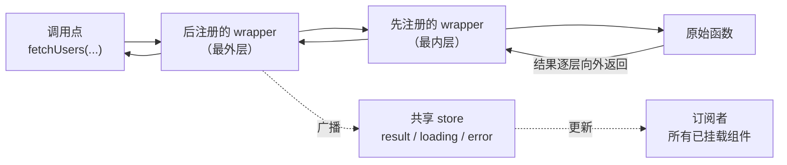

# React Toolroom

> 零依赖的 React 工具集：不需要 `useCallback` 的运行时 memoization，不需要 Provider 的可组合数据请求 hooks。

[English](./README.md) | [中文](./README-zh_CN.md)

## 特性

- **零依赖、体积极小** — `react-toolroom` 1.4 kB，`react-toolroom/async` 3.02 kB（minified + brotli，含共享 chunk），由 CI 的 2 kB / 4 kB 预算强制约束。
- **无 Provider、无 Context** — 每个 hook 独立生效，状态挂在传入的函数上，应用根部不需要挂载任何东西。
- **原子化、可组合** — 每个能力就是一个小 hook。像积木一样组合 `useCache` + `useDedup` + `usePolling`，用不到的直接被 tree-shaking 掉。
- **跨组件注入** — 任意组件都能通过洋葱模型给另一个组件的 fetcher 叠加中间件（wrapper），注入方卸载时自动摘除。
- **React 16.8 – 19** — 一套代码路径，覆盖广谱版本。
- **TypeScript 优先** — 源码即 TypeScript，`.d.ts` 从源码生成；162 个测试。

## 安装

```bash
npm i react-toolroom
```

两个入口：`react-toolroom`（核心：`memo`、`stableHash`）与 `react-toolroom/async`（数据请求 hooks）。

## 什么时候选这个库

React Toolroom 并不想做完整的"服务端状态管理器"。它把使用频率最高的 20% 能力——缓存、去重、轮询、焦点重验证、取消——用不到 4 kB、无 Provider 的代价交付给你。下面是一份诚实的对比：

| 能力 | react-toolroom | TanStack Query | SWR | ahooks `useRequest` |
| --- | --- | --- | --- | --- |
| 运行时依赖 | **0** | 0 | 0 | ahooks 本体 |
| 需要全局 Provider | **不需要** | 需要（`QueryClientProvider`） | 不需要 | 不需要 |
| 请求去重 | `useDedup` | 内置 | 内置 | ✗（只有防抖/节流） |
| 轮询 | `usePolling` | `refetchInterval` | `refreshInterval` | `pollingInterval` |
| 焦点时重新请求 | `useFocusRevalidate` | `refetchOnWindowFocus` | `revalidateOnFocus` | `refreshOnWindowFocus` |
| mutation 联动失效缓存 | `useInvalidate` | `invalidateQueries` | 手动 `mutate` | 手动 |
| 无限加载 | ✗ | `useInfiniteQuery` | `useSWRInfinite` | `useInfiniteScroll` |
| key 变化时保留旧数据 | **默认行为** | `placeholderData: keepPreviousData` | `keepPreviousData: true` | ✗ |
| DevTools | `subscribeInjectEvents`（观察 API） | ✅ | 社区版 | ✗ |
| SSR / hydration | ✗ | ✅ | ✅ | 有限支持 |
| 请求中间件 | 洋葱 wrapper，组件级，无 Provider | ✗（仅 query cache 事件） | ✅（经 `SWRConfig`） | ✗ |
| React 版本 | **16.8 – 19** | 18+（v5） | 16.11+（v2） | 16.8+（v3） |
| 包体积¹ | **1.4 kB** + **3.02 kB** | ≈ 13 kB | ≈ 4 kB | ≈ 5 kB+ |

¹ 均为 minified + 压缩后、只算入口的体积。react-toolroom 的数字是 CI 强制约束的精确值；竞品数字是大致值，随版本变化，请以各自文档为准。

**选 react-toolroom**：中小型应用、嵌进组件库发布、或者只想按需挑几个能力且把代价压到最小的场景。**选 TanStack Query**：需要完整的服务端状态管理——托管式 mutation 与乐观更新、按 query-key 谓词全缓存失效、无限查询、SSR hydration、DevTools 面板的时候。

## 快速上手

### 核心：`memo`，不需要 `useCallback` 的 `React.memo`

```tsx
import {memo} from 'react-toolroom';

const MemoSendButton = memo(SendButton);

function Chat() {
  const [text, setText] = useState('');
  const [messages, setMessages] = useState<string[]>([]);

  // `onClick` 每次渲染都是新函数，但用户输入时 memo 过的按钮
  // 依然跳过重渲染——不需要 `useCallback`。
  return (
    <>
      <textarea value={text} onChange={(e) => setText(e.target.value)} />
      <MemoSendButton onClick={() => setMessages([...messages, text])} />
    </>
  );
}
```

`memo` 会稳定"长得像事件处理器"的函数 props（默认匹配 `/^on[A-Z]/`），调用时再转发给最新的处理器：子组件拿到稳定引用，你的闭包永远是新鲜的。

### Async：围绕一个 injectable 组合 hooks

```tsx
import {
  useError,
  useInitialLoading,
  useInjectable,
  useResult,
  useRun
} from 'react-toolroom/async';
import {fetchList} from './services/user';

function UserList() {
  // 1. 把 fetcher 变为可注入的（这是个 hook——要放在下面这些 hooks 之前调用）。
  const fetchUsers = useInjectable(fetchList);

  // 2. 以任意顺序叠加能力；每个 hook 只注册一个 wrapper。
  useRun(fetchUsers, []); // 挂载时执行一次
  const users = useResult(fetchUsers);
  const initialLoading = useInitialLoading(fetchUsers);
  const error = useError(fetchUsers);

  if (initialLoading) return <p>loading…</p>;
  if (error) return <p>{error.message}</p>;

  return (
    <ul>
      {users?.map((user) => (
        <li key={user.id}>{user.username}</li>
      ))}
    </ul>
  );
}
```

## `memo` 与 React Compiler 的关系

[React Compiler](https://react.dev/learn/react-compiler) 已于 2025 年 10 月发布 1.0 并进入 stable。它在**构建期**自动 memoize：把编译器加进构建流程，它会改写组件代码，让组件内的值保持稳定引用。

`react-toolroom/memo` 则是**运行时、零配置**方案——`React.memo` 的直接替代品，专门稳定事件处理器 props。两者不冲突，而且在编译器帮不上忙的地方 `memo` 依然有效：

- **还没接入编译器工具链的项目** — 存量代码库、渐进迁移、暂时不方便加 Babel 插件的构建。
- **被编译器跳过（bailout）的组件** — 遇到无法静态分析的模式时编译器会放弃，这些组件不手动 memo 就会照常重渲染。
- **未编译发布的库代码** — 应用的编译器不处理 `node_modules`，以纯 JS 发布的组件库依然能从"稳定接收到的 handler props"中获益。
- **广谱 React 版本** — `memo` 用同一套代码路径支持 React 16.8 到 19。

如果你已经在用编译器，请继续用：它负责组件内部派生数据的 memoization。`memo` 负责跨组件边界的事件 handler 引用稳定——这一层，编译器只对它真正编译到的代码生效。

## 注入机制（洋葱模型）

`useInjectable(fn)` 返回一个签名与 `fn` 相同、且跨渲染引用稳定的函数。调用它时，原始函数会被所有已注册的 wrapper 依次包裹执行——最外层先执行，最内层最后执行、离原始函数最近：



每个能力 hook——`useResult`、`useLoading`、`useCache`、`useDedup`……——本质上只是一次 `useInject` 注册，所以它们能以任意顺序组合。wrapper **每个 hook 实例只注册一次**（重渲染和 StrictMode 双渲染都不会产生重复注册），并在**注入方组件卸载时自动摘除**。

wrapper 列表挂在 injectable 本身上，因此一个组件可以给*另一个*组件创建的 fetcher 叠加行为——不需要 Provider 的跨组件注入：

```tsx
import {useInject, useInjectable} from 'react-toolroom/async';
import {fetchList} from './services/user';

// 自定义 wrapper：接收下一层内层函数，返回替换后的函数。
function withTiming() {
  return (f: typeof fetchList) => async (...args) => {
    const start = performance.now();
    try {
      return await f(...args);
    } finally {
      console.log(`fetchUsers took ${performance.now() - start}ms`);
    }
  };
}

function UserList({fetchUsers}: {fetchUsers: typeof fetchList}) {
  useInject(fetchUsers, withTiming());
  // ……useResult / useRun / 渲染……
}

function DevProbe({fetchUsers}: {fetchUsers: typeof fetchList}) {
  // 给一个不属于自己的 fetcher 挂 wrapper。
  // <DevProbe /> 卸载时自动移除。
  useInject(fetchUsers, (f) => async (...args) => {
    const users = await f(...args);
    console.log('fetched', users.length, 'users');
    return users;
  });
  return null;
}

function UsersPage() {
  const fetchUsers = useInjectable(fetchList);
  return (
    <>
      <UserList fetchUsers={fetchUsers} />
      {import.meta.env.DEV && <DevProbe fetchUsers={fetchUsers} />}
    </>
  );
}
```

wrapper 接收 `(nextFn, callContext)`：`nextFn` 是要调用的下一层内层函数；`callContext` 是每次调用新生成的对象——当 `useRun` 以 `{signal: true}` 运行时，末尾追加的 `AbortSignal` 会以 `callContext.signal` 暴露出来，让更深层的 wrapper 能感知取消。需要跨调用共享状态时，`getInjectContext(fetchUsers)` 返回该 injectable 的稳定 context 对象（result 和 loading store 就存在这里）。`useInjectBefore` 是高级变体：它把 wrapper 插到链头而非链尾，因此先于已注册的 wrapper 被应用，最终位于最内层、紧贴原始函数。

注册 wrapper 也不一定需要 hook。注入模块还导出 `addWrapper(fn, wrapper)`——签名同为 `InjectWrapper<F>`（`(f, callContext) => f`）的非 hook 原语——它向同一条链压入 wrapper 并返回退订函数；`subscribeInjectEvents` 本身就是架在它上面的一层薄观察器，非 React 工具（日志面板、devtools）正是这样接入调用链的。反方向上，`useRun` 甚至不要求传入 injectable：它会先用 `isInjectable(fn)` 探测参数，普通函数完全跳过 wrapper 机制，同时保持相同的"变化即重跑"行为。

## 实战示例

### 连点去重 — `useDedup`

```tsx
const loadReport = useInjectable(fetchReport);
useDedup(loadReport);
const report = useResult(loadReport);

// 接口耗时 2 秒。请求进行中连点 5 次，只会发出 1 次真实请求；
// 所有并发调用拿到同一个结果。
<button type='button' onClick={() => loadReport()}>刷新</button>;
```

去重键默认使用 `stableHash`：它对键的插入顺序不敏感，并把每个 `AbortSignal` 映射为固定占位符——所以 `useRun(fn, args, {signal: true})` 的重复运行依然能命中去重。promise 落定后条目即被删除，失败的调用因此可以被重试。

### 轮询与焦点重验证 — `usePolling` + `useFocusRevalidate`

```tsx
const statCache = createMemoryCacheProvider<FocusStat, any[]>({cacheTime: 60000});

function Dashboard() {
  const loadStat = useInjectable(fetchFocusStat);
  const isStale = useCache(loadStat, statCache, 5000); // 5 秒内算新鲜
  useFocusRevalidate(loadStat); // 窗口聚焦 / 标签页重新可见时重新请求
  useRun(loadStat, []);
  const stat = useResult(loadStat);
  // 切走超过 5 秒再切回来：缓存数据立即渲染，
  // 随后是后台重新验证。
}

// 轮询放在子组件里，通过挂载/卸载来启停定时器
// （hooks 不能条件调用）。
function Ticker() {
  const loadTicker = useInjectable(fetchTicker);
  useRun(loadTicker, []);
  usePolling(loadTicker, 3000); // 每 3 秒
  const ticker = useResult(loadTicker);
}
```

`usePolling` 在上一轮还没结束时跳过本轮（慢接口永远不会堆出并发请求），页面隐藏时自动暂停，除非传 `{whenHidden: true}`。`useFocusRevalidate` 用 `{interval}` 节流（默认 `0`）。两者都接受 `{args}`：当 fetcher 带键参数时（`useRun(loadUser, [userId])`），传入相同的元组——`usePolling(loadUser, 10000, {args: [userId]})`——让每一轮都命中与 `useCache`/`useDedup` 相同的键，而不是开出一条以 `[]` 为键的第二请求线。

### 取消过期请求 — `useRun` 的 signal

```tsx
const loadDetail = useInjectable((detailId: number, signal: AbortSignal) =>
  fetchDetail(detailId, signal)
);

// 每次运行会向函数尾部追加一个新 AbortSignal；
// `id` 变化或组件卸载时，上一个 signal 被自动 abort。
useRun(loadDetail, [id], {signal: true});

const loading = useLoading(loadDetail);
const detail = useResult(loadDetail);
const error = useError(loadDetail); // 被取消的调用以 AbortError reject
```

配合 `useCatch`，可以在请求被新请求取代时继续展示旧数据而不是报错。`useRun` 也接受普通（非 injectable）函数。

### SWR 缓存 — `useCache`

```tsx
// 模块顶层：createMemoryCacheProvider 不是 hook，
// 缓存可以被所有引用它的组件共享。
const userCache = createMemoryCacheProvider<User[], any[]>({cacheTime: 10000});

function UserList() {
  const fetchUsers = useInjectable(fetchList);
  const isStale = useCache(fetchUsers, userCache, 2000); // staleTime: 2 秒
  const users = useResult(fetchUsers);
  useRun(fetchUsers, []);

  return isStale ? <UserListSkeleton users={users} /> : <UserTable users={users} />;
}
```

命中缓存时，缓存值**立即**广播给所有订阅者——组件不用等网络就能渲染出数据。若缓存已超过 `staleTime`（默认 `0`：每次命中都重新验证），会触发后台 refetch，完成后更新所有人；后台 refetch 的失败被静默吞掉，过期数据继续留在屏幕上。默认参数下，`createMemoryCacheProvider()` 永久保留条目（`cacheTime: Infinity`）并用 `stableHash` 计算键；设置了有限 `cacheTime` 时，一旦没有任何组件在使用，缓存会在该时长后自行清空。返回的 `stale` 同样是共享状态：同一 injectable 的所有 `useCache` 消费者读取同一个广播标志、一起更新，最后一次判定生效。

### mutation 之后失效缓存 — `useInvalidate`

```tsx
const userCache = createMemoryCacheProvider<User[], any[]>({cacheTime: 10000});

function UserList() {
  const fetchUsers = useInjectable(fetchList);
  useCache(fetchUsers, userCache, 5000);
  const invalidateUsers = useInvalidate(fetchUsers, userCache);
  const users = useResult(fetchUsers);
  useRun(fetchUsers, []);

  async function handleRename(user: User, name: string) {
    await renameUser(user.id, name);      // 先执行 mutation
    await invalidateUsers();              // 再刷新列表
  }

  // ……渲染 `users`，把 `handleRename` 接到编辑表单上……
}
```

与 stale-while-revalidate 的后台 refetch 不同——后者在刷新期间继续供旧值——`useInvalidate` 是硬失效：先删除给定参数下的缓存条目，再立刻用同样的参数重跑 injectable，订阅者看到的是全新的 loading → result 周期，而不是 mutation 前的旧数据。键联动与 `useCache` 一致：同一个 `cacheProvider` 加同一个参数元组寻址同一条目（`useInvalidate(fetchUser, userCache)(userId)` 删掉的就是 `useRun(fetchUser, [userId])` 填充的那条）。返回的函数引用稳定、resolve 为新结果，mutation 处理器里 `await` 它之后再关掉 toast 即可。

### `useLoading` 与 `useInitialLoading` 的区别

```tsx
const initialLoading = useInitialLoading(fetchUsers); // 还完全没有任何数据
const refreshing = useLoading(fetchUsers);            // 任意调用进行中
```

- `useLoading` — **任意**一次调用进行中就为 `true`，无论首次加载还是后台刷新。
- `useInitialLoading` — 仅当"有调用进行中**且尚无任何结果**（无论来自请求还是缓存）"时为 `true`。这就是 SWR `isLoading` 的语义：一旦屏幕上有数据，后台 refetch 就不再计入。整页 skeleton 用它；"刷新中…"的小指示用 `useLoading`。

### 用 Suspense 代替 skeleton — `useSuspenseResult`

```tsx
import {Suspense} from 'react';

// 持有者负责驱动请求——必须在 Suspense boundary 之外。
function UserList() {
  const fetchUsers = useInjectable(fetchList);
  useRun(fetchUsers, []);
  return (
    <Suspense fallback={<p>loading…</p>}>
      <UserTable fetchUsers={fetchUsers} />
    </Suspense>
  );
}

function UserTable({fetchUsers}: {fetchUsers: typeof fetchList}) {
  const users = useSuspenseResult(fetchUsers); // 挂起，直到有数据
  // ……渲染表格，没有 `undefined` 分支，没有 skeleton……
}
```

`useSuspenseResult` 抛出 in-flight promise 而不是返回 `undefined`，让声明式 fallback 取代手写的 loading 标志。它只负责读——发起请求依然是 `useRun`、轮询或手动调用的职责。⚠️ 驱动方必须位于 `<Suspense>` boundary **之外**的父组件：被挂起的子树永远不会 commit，其 effect 也就不会执行——在*同一个*组件里同时调用 `useRun` 和 `useSuspenseResult` 会死锁（本该结束挂起的那次请求根本不会发出）。首个结果落地后，后续结果与 `useResult` 一样经共享 result store 持续流入。

### 翻页时保留旧数据

```tsx
function UserList() {
  const [page, setPage] = useState(1);
  const loadUsers = useInjectable((query: {page: number}) => fetchUsers(query));

  // `hash` 按结构比较参数，只有页码真的变了才会重新请求。
  useRun(loadUsers, [{page}], {hash: stableHash});

  const users = useResult(loadUsers);    // 新一页加载期间，渲染的仍是上一页
  const loading = useLoading(loadUsers); // true —— 显示小指示器，而不是 skeleton

  return (
    <div>
      {loading && <p>loading…</p>}
      <ul>
        {users?.map((u) => (
          <li key={u.id}>{u.username}</li>
        ))}
      </ul>
      <button type='button' disabled={page === 1} onClick={() => setPage(page - 1)}>
        上一页
      </button>
      <button type='button' onClick={() => setPage(page + 1)}>
        下一页
      </button>
    </div>
  );
}
```

`page` 变化时，旧一页会一直留在屏幕上，直到新结果落地：共享的 result store 在调用之间从不重置，且每次调用持有的序号票券会丢弃任何比最新已应用结果更旧的写入——慢请求无法覆盖新调用已经交付的数据。TanStack Query 需要配置 `placeholderData: keepPreviousData`、SWR 需要 `keepPreviousData: true` 才能得到这个行为；本库中它是默认行为，无需任何选项。首次加载配合 `useInitialLoading`（整页 skeleton），重访页面配合 `useCache`（命中缓存立即渲染、后台重新验证）。

### 观察每一次调用 — `subscribeInjectEvents`

```tsx
const fetchUsers = useInjectable(fetchList);

// 零依赖的调用轨迹——不需要任何 DevTools 面板。
const stop = subscribeInjectEvents(fetchUsers, {
  onCall: (args) => console.log('→ fetchUsers', ...args),
  onSettle: ({args, result, error, duration}) =>
    console.log('← fetchUsers', {args, result, error, duration})
});
// stop() 再次移除观察器。
```

`subscribeInjectEvents` 是普通函数而非 hook——可以在 effect、模块顶层甚至浏览器控制台里注册。观察器注册为最外层 wrapper，因此 `onSettle` 每次调用恰好触发一次，携带 `{args, result | error, duration}`，其中 `duration` 度量它观察到的整条洋葱链（原始函数加订阅之前注册的所有 wrapper）。最小日志面板只需在它上面叠一层状态：把每次 settle 事件推进数组再渲染即可。想要同一洋葱模型的可运行演示——跨组件注入、层次顺序、卸载自动移除——见 [`demos/views/Async/Inject.tsx`](./demos/views/Async/Inject.tsx)。

## API 参考

### 核心 — `react-toolroom`

| API | 说明 |
| --- | --- |
| `memo(Component, options?)` | 自动 memoize 事件处理器 props 的 `React.memo`，从此不需要 `useCallback`。`options`：`{testEvent?, propsAreEqual?}` 或直接传 `propsAreEqual(prev, next)` 函数。 |
| `memoBase(Component, {testEvent, propsAreEqual?})` | 底层变体：必须传完整 options 对象，不帮你填默认值。 |
| `defaultTestEvent(key)` | 默认的 `testEvent`：`/^on[A-Z]/.test(key)`。 |
| `stableHash(value)` | 结构化哈希：对象键排序、支持 `Map`/`Set`、循环引用安全、`AbortSignal` 映射为固定占位符。两个入口均可导入；是 `useDedup` 和 `createMemoryCacheProvider` 的默认 `hash`，也可以作为自定义键的基础构件，如 `hash: (args) => 'user:' + stableHash(args)`。 |
| `isAbortSignal(value)` | 判断值是否为 `AbortSignal`：`instanceof` 快路径加鸭子类型回退（`aborted` 属性 + `addEventListener` 函数），因此跨 realm 的 signal（iframe、测试替身）乃至没有全局 `AbortSignal` 的环境都能正确识别。两个入口均可导入；是 `stableHash` 的 signal 占位符与 `useRun` signal 桥的基础。 |

### Async — `react-toolroom/async`

| API | 说明 |
| --- | --- |
| `useInjectable(fn)` | 把任意函数变为带私有 wrapper 链的 injectable；返回的函数跨渲染引用稳定。 |
| `isInjectable(fn)` | `fn` 是否为 `useInjectable` 的产物——`useRun` 用它兼容普通（非 injectable）函数，你自己的 wrapper 也可以用它做探测。 |
| `useInject(fn, wrapper)` | 在 injectable 上注册 `wrapper: (nextFn, callContext) => nextFn`；每个 hook 实例只注册一次，卸载时移除。 |
| `useInjectBefore(fn, wrapper)` | 高级 API：把 wrapper 插入链头——先于已注册的 wrapper 被应用，最终位于最内层、紧贴原始函数。 |
| `getInjectContext(fn)` | injectable 的稳定 context 对象——wrapper 在这里存放跨调用共享的状态。 |
| `subscribeInjectEvents(fn, {onCall, onSettle})` | 非 hook 的观察 API，面向 devtools/日志面板：链执行前触发 `onCall(args)`，每次调用落定时恰好触发一次 `onSettle({args, result?, error?, duration})`，`duration` 覆盖观察者之下的整条洋葱链。返回退订函数。 |
| `useResult(fn, init?)` | 订阅最新结果；结果广播给所有消费者，晚订阅的组件直接从共享的上次结果起步。 |
| `useSuspenseResult(fn)` | 类似 `useResult`，但在首个结果存在前挂起（抛出 in-flight promise）。必须配 `<Suspense>` boundary，且驱动方（`useRun` 或手动调用）必须位于 boundary 之外的父组件。首个结果后，更新与 `useResult` 完全一致地流入。 |
| `useLoading(fn)` | 任意调用进行中为 `true`。 |
| `useInitialLoading(fn)` | 有调用进行中且尚无结果时为 `true`（SWR 的 `isLoading`）。 |
| `useError(fn)` | 最近一次抛出的错误；成功时清空。 |
| `useFailureCount(fn)` | 距上次成功以来的失败次数（成功时归零）。 |
| `useCatch(fn, catcher)` | 通过 `catcher(e) => result` 把 rejection 转为兜底值。 |
| `useFinally(fn, handler)` | 调用落定时执行 `handler`，无论成败。 |
| `useRetry(fn, shouldRetry)` | `shouldRetry(failureCount, e)` 返回 `true` 就重试；返回 `Promise` 则等它落定后再重试（可实现退避）。 |
| `useRun(fn, args, options?)` | 挂载时及 `args` 变化时执行 `fn(...args)`。`{signal: true}` 会向末尾追加 `AbortSignal` 参数，并在变化/卸载时 abort；`{hash}`（如 `stableHash`）用结构化键取代引用比较，`args` 里的不稳定引用只在真正变化时才重跑——与 `useDedup`/`useCache` 的键语义一致。普通（非 injectable）函数经 `isInjectable` 探测后直接执行。 |
| `useCache(fn, cacheProvider, staleTime = 0)` | SWR 缓存：命中立即广播；过期条目后台重新验证。返回当前数据是否过期——该标志是同一 injectable 所有 `useCache` 消费者共享的广播状态，一起更新（最后一次判定生效）。 |
| `useInvalidate(fn, cacheProvider)` | 返回稳定的 `(...args) => Promise<R>`：删除 `args` 下的缓存条目并立刻用这些参数重跑 injectable——面向 mutation 成功路径的硬失效。经由相同 provider 与参数元组与 `useCache` 键联动。 |
| `createMemoryCacheProvider({cacheTime = Infinity, hash = stableHash})` | 内存版 `CacheProvider`，提供 `get/set/delete/clear/use`；设置有限 `cacheTime` 且无人使用后，闲置超过该时长即整体清空。 |
| `useDedup(fn, {hash = stableHash}?)` | 同键并发调用共享同一个 in-flight promise；落定即删条目，失败可重试。 |
| `usePolling(fn, interval, {whenHidden = false, args = []}?)` | 每 `interval` 毫秒调用一次 `fn(...args)`；上一轮未完成时跳过本轮；页面隐藏时暂停（除非 `whenHidden`）。`interval` 变化会重启定时器。`args` 命中与 `useRun(fn, args)` 相同的 `useCache`/`useDedup` 键——`useRun` 带键时请传相同元组。 |
| `useFocusRevalidate(fn, {interval = 0, args = []}?)` | 窗口聚焦及 `visibilitychange` 变回可见时重新请求，`interval` 节流；`args` 展开进每次重新验证，键语义与 `useRun` 一致。 |
| `stableHash(value)` | 此处为便捷再导出——见上方核心表。 |

编写自定义 wrapper 和 cache provider 所需的类型同样从两个入口导出：`react-toolroom/async` 提供 `AsyncFunc`、`Func`、`R<AF>`、`CacheProvider<R, Args>`、`CacheResult<R>`；核心入口提供 `Func`。

## 工程事实

- **仅 ESM** — `exports` 映射提供 `types` / `import` / `default` 条件，指向 `.mjs` 文件；没有 CJS 产物。若需直接跑在 CJS/Node 上，请先自行打包。
- **CI 体积预算** — [size-limit](./.size-limit.json) 约束 `react-toolroom` 小于 2 kB、`react-toolroom/async` 小于 4 kB（brotli，入口 + 共享 chunk）。当前实测 1.4 kB / 3.02 kB。
- **可 tree-shaking** — `sideEffects: false`，两个独立入口，原子化 hooks：引入一个能力，只为它及少量依赖买单。
- **peerDependencies** — `react` 与 `react-dom`：`^16.8.0 || ^17.0.0 || ^18.0.0 || ^19.0.0`。
- **TypeScript 优先** — 以 TypeScript 编写；类型声明由源码生成。
- **测试覆盖** — 162 个测试（vitest + Testing Library）。

## 示例

见 [demos](./demos/)：`memo`、请求去重、轮询、焦点重验证、SWR 缓存、`AbortSignal` 取消、跨组件注入（洋葱模型）等可运行示例。

## 文档

[API 文档](https://wmzy.github.io/react-toolroom/)

## 相关项目

- [painless](https://github.com/wmzy/painless) - 前端模板
- [native-router](https://github.com/native-router/react) - 路由

## 贡献

欢迎贡献！

## 许可证

MIT
