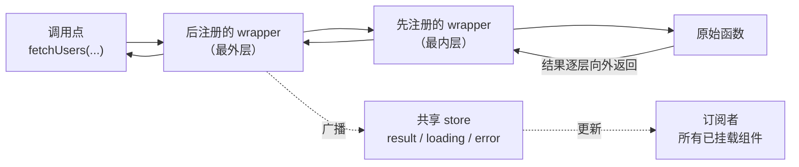

# React Toolroom

> 零依赖的 React 工具集：不需要 `useCallback` 的运行时 memoization，不需要 Provider 的可组合数据请求 hooks。

[English](./README.md) | [中文](./README-zh_CN.md)

[](https://www.npmjs.com/package/react-toolroom)
[](https://github.com/wmzy/react-toolroom/actions/workflows/ci.yml)

## 特性

- **零依赖、体积极小** — 全量入口 `react-toolroom` 2.7 kB、`react-toolroom/async` 7.4 kB（minified + brotli，含共享 chunk）；可 tree-shaking、按需付费——实际成本取决于你引入的能力，而非全量入口。
- **无 Provider、无 Context** — 每个 hook 独立生效，状态挂在传入的函数上，应用根部不需要挂载任何东西。
- **原子化、可组合** — 每个能力就是一个小 hook。像积木一样组合 `useCache` + `usePolling`，用不到的直接被 tree-shaking 掉。
- **跨组件注入** — 任意组件都能通过洋葱模型给另一个组件的 fetcher 叠加中间件（wrapper），注入方卸载时自动摘除。
- **React 16.8 – 19** — 一套代码路径，覆盖广谱版本。
- **TypeScript 优先** — 源码即 TypeScript，`.d.ts` 从源码生成；358 个测试。

## 安装

```bash
npm i react-toolroom
```

两个入口：`react-toolroom`（核心：`memo`、`createMemoryCacheProvider`、`stableHash`）与 `react-toolroom/async`（数据请求 hooks）。

## 什么时候选这个库

React Toolroom 并不想做完整的"服务端状态管理器"。它把使用频率最高的 20% 能力——缓存、去重、轮询、焦点重验证、断网重连重验证、取消、与 mutation 联动的失效——用约 6.4 kB、无 Provider 的代价交付给你（按需引入更低）。下面是一份诚实的对比：

| 能力 | react-toolroom | TanStack Query | SWR | ahooks `useRequest` |
| --- | --- | --- | --- | --- |
| 运行时依赖 | **0** | 0 | 0 | ahooks 本体 |
| 需要全局 Provider | **不需要** | 需要（`QueryClientProvider`） | 不需要 | 不需要 |
| 请求去重 | 内置（缓存 provider 的 `load`；无缓存时 `useRun` 并发同参同样共享一次请求） | 内置 | 内置 | ✗（只有防抖/节流） |
| 轮询 | `usePolling` | `refetchInterval` | `refreshInterval` | `pollingInterval` |
| 焦点时重新请求 | `useFocusRevalidate` | `refetchOnWindowFocus` | `revalidateOnFocus` | `refreshOnWindowFocus` |
| 网络恢复时重新请求 | `useReconnectRevalidate` | 内置 | 内置 | ✗ |
| mutation 生命周期 | `useMutation` | `useMutation` | `useSWRMutation` | 手动 |
| mutation 联动失效缓存 | `useInvalidate` / `invalidates` | `invalidateQueries` | 手动 `mutate` | 手动 |
| 无限加载 | ✅ `useInfinite` | `useInfiniteQuery` | `useSWRInfinite` | `useInfiniteScroll` |
| key 变化时保留旧数据 | **默认行为** + `usePlaceholderData` 标志 | `placeholderData: keepPreviousData` | `keepPreviousData: true` | ✗ |
| DevTools | ✅ `InjectDevTools` 面板（独立入口） | ✅ | 社区版 | ✗ |
| SSR / hydration | ✅ `dehydrate`/`hydrate` | ✅ | ✅ | 有限支持 |
| 请求中间件 | 洋葱 wrapper，组件级，无 Provider | ✗（仅 query cache 事件） | ✅（经 `SWRConfig`） | ✗ |
| React 版本 | **16.8 – 19** | 18+（v5） | 16.11+（v2） | 16.8+（v3） |
| 包体积¹ | **2.7 kB** + **7.4 kB** | ≈ 13 kB | ≈ 4 kB | ≈ 5 kB+ |

¹ 均为 minified + 压缩后、全量入口（未 tree-shaking）的体积，是按需引入的上界。react-toolroom 的数字是 CI 构建产物的实测值；竞品数字是大致值，随版本变化，请以各自文档为准。

**选 react-toolroom**：中小型应用、嵌进组件库发布、或者只想按需挑几个能力且把代价压到最小的场景。**选 TanStack Query**：想要一个托管式服务端状态客户端——按 query-key 谓词全缓存失效、由客户端自身打理的 mutation 与 query 联动、持久化插件、以及完整 DevTools 的时候。

一个随设计而来的存储边界值得先知道：injectable 的 result store 是单一广播槽，`useResult` 读到的是**最后一次 settle**，无论它由哪组参数产生（这正是 keep-previous-data 成为默认行为、渲染保持廉价的原因）。同一 injectable 服务多组参数的屏幕应改走 keyed 通道——`useKeyedResult(fn, args)` / `useArgsStatus(fn, args)`——即 TanStack 由 `queryKey` 天然赋予的按 key 观察语义。

## 一次性写好你项目的 query hook

React Toolroom 不提供配置式 preset hook——没有 `useQuery(options)`。这是刻意为之：把原子 hooks 已经直接表达的东西重新编码成一张选项表，维护成本与组合本身相当，还会在你最需要看清机制的时刻把它藏起来。正确姿势是：**一次性**写好你项目的 query hook，然后到处使用——之后调整这段组合，代价并不比改配置对象高。

[`recipes/`](./recipes/) 目录提供了可复制、可定制的起点模板：

| 模板 | 组合方式 |
| --- | --- |
| [`useProjectQuery.ts`](./recipes/useProjectQuery.ts) | 基础版：`useInjectable` + `useRun(…, {signal: true})` + `useResult` / `useInitialLoading` / `useError`。 |
| [`useProjectMutation.ts`](./recipes/useProjectMutation.ts) | 写操作侧，叠在一等 `useMutation` 之上：钉住项目默认的失败上报，显式 `onError` 仍可替换——这是给库 hook 叠加项目约定的范式。 |
| [`useProjectSWRQuery.ts`](./recipes/useProjectSWRQuery.ts) | 加 `useCache(staleTime)`（模块级缓存实例）+ `useFocusRevalidate`。 |
| [`useProjectPollingQuery.ts`](./recipes/useProjectPollingQuery.ts) | 加固定间隔的 `usePolling`。 |
| [`useProjectPaginatedQuery.ts`](./recipes/useProjectPaginatedQuery.ts) | 按键运行的 `useRun(fn, [{page}], {hash: stableHash})`，默认保留旧数据，并用 `usePlaceholderData` 把它变成可观察的标志；`useLoading` 做小刷新指示器，`useInitialLoading` 做首屏骨架。 |
| [`createLocalCacheProvider.ts`](./recipes/createLocalCacheProvider.ts) | 把条目持久化到 `localStorage` 的 `CacheProvider`——面向应当挺过页面刷新、而非每次从零重建的缓存。 |

复制最贴近你场景的一份，替换成你的 fetcher，再按每个文件头列出的常见定制点调整：`staleTime`、错误上报、缓存实例、返回形状。一个 hook 让所有屏幕共用同一套 loading/error 契约——并且只有一处需要修改。

至于服务端的部分——在 App Router 中预热缓存、hydration、以及 React Server Components 里哪些能用哪些不能用——见 [Next.js / RSC 集成指南](./docs/nextjs-rsc.md)。

至于渲染成本的部分——为何 settle 必然产生新引用（无结构共享）、这对 `React.memo` 边界意味着什么、以及如何让重渲染保持廉价（标量 props、`on*` 稳定身份、`useResultSelect` 切片、保引用的写路径）——见 recipe [无结构共享的 memo 策略](./docs/no-structural-sharing.md)。

## 快速上手

### 核心：`memo`，不需要 `useCallback` 的 `React.memo`

```tsx
import {memo} from 'react-toolroom';

const MemoSendButton = memo(SendButton);

function Chat() {
  const [text, setText] = useState('');
  const [messages, setMessages] = useState<string[]>([]);

  // `onClick` 每次渲染都是新函数，但用户输入时 memo 过的按钮
  // 依然跳过重渲染——不需要 `useCallback`。
  return (
    <>
      <textarea value={text} onChange={(e) => setText(e.target.value)} />
      <MemoSendButton onClick={() => setMessages([...messages, text])} />
    </>
  );
}
```

`memo` 会稳定"长得像事件处理器"的函数 props（默认匹配 `/^on[A-Z]/`），调用时再转发给最新的处理器：子组件拿到稳定引用，你的闭包永远是新鲜的。

### Async：围绕一个 injectable 组合 hooks

```tsx
import {
  useError,
  useInitialLoading,
  useInjectable,
  useResult,
  useRun
} from 'react-toolroom/async';
import {fetchList} from './services/user';

function UserList() {
  // 1. 把 fetcher 变为可注入的（这是个 hook——要放在下面这些 hooks 之前调用）。
  const fetchUsers = useInjectable(fetchList);

  // 2. 以任意顺序叠加能力；每个 hook 只注册一个 wrapper。
  useRun(fetchUsers, []); // 挂载时执行一次
  const users = useResult(fetchUsers);
  const initialLoading = useInitialLoading(fetchUsers);
  const error = useError(fetchUsers);

  if (initialLoading) return <p>loading…</p>;
  if (error) return <p>{error.message}</p>;

  return (
    <ul>
      {users?.map((user) => (
        <li key={user.id}>{user.username}</li>
      ))}
    </ul>
  );
}
```

### DevTools：挂一个调用轨迹面板

```tsx
import {InjectDevTools} from 'react-toolroom/devtools';

// 仅开发环境，挂在树里任意位置——独立入口、内联样式、零依赖。
<InjectDevTools injectables={[fetchUsers]} />

// 预设 hook 内部的 injectable 拿不到引用——给它起名
// （useInjectable(fn, {name: 'fetchTags'}))后省略 prop：
// 面板自动发现所有存活的具名 injectable。
<InjectDevTools />
```

## `memo` 与 React Compiler 的关系

[React Compiler](https://react.dev/learn/react-compiler) 已于 2025 年 10 月发布 1.0 并进入 stable。它在**构建期**自动 memoize：把编译器加进构建流程，它会改写组件代码，让组件内的值保持稳定引用。

`react-toolroom/memo` 则是**运行时、零配置**方案——`React.memo` 的直接替代品，专门稳定事件处理器 props。两者不冲突，而且在编译器帮不上忙的地方 `memo` 依然有效：

- **还没接入编译器工具链的项目** — 存量代码库、渐进迁移、暂时不方便加 Babel 插件的构建。
- **被编译器跳过（bailout）的组件** — 遇到无法静态分析的模式时编译器会放弃，这些组件不手动 memo 就会照常重渲染。
- **未编译发布的库代码** — 应用的编译器不处理 `node_modules`，以纯 JS 发布的组件库依然能从"稳定接收到的 handler props"中获益。
- **广谱 React 版本** — `memo` 用同一套代码路径支持 React 16.8 到 19。

如果你已经在用编译器，请继续用：它负责组件内部派生数据的 memoization。`memo` 负责跨组件边界的事件 handler 引用稳定——这一层，编译器只对它真正编译到的代码生效。

## 注入机制（洋葱模型）

`useInjectable(fn)` 返回一个签名与 `fn` 相同、且跨渲染引用稳定的函数。调用它时，原始函数会被所有已注册的 wrapper 依次包裹执行——最外层先执行，最内层最后执行、离原始函数最近：



每个能力 hook——`useResult`、`useLoading`、`useCache`……——本质上只是一次 `useInject` 注册，所以它们能以任意顺序组合。wrapper **每个 hook 实例只注册一次**（重渲染和 StrictMode 双渲染都不会产生重复注册），并在**注入方组件卸载时自动摘除**。

wrapper 列表挂在 injectable 本身上，因此一个组件可以给*另一个*组件创建的 fetcher 叠加行为——不需要 Provider 的跨组件注入：

```tsx
import {useInject, useInjectable} from 'react-toolroom/async';
import {fetchList} from './services/user';

// 自定义 wrapper：接收下一层内层函数，返回替换后的函数。
function withTiming() {
  return (f: typeof fetchList) => async (...args) => {
    const start = performance.now();
    try {
      return await f(...args);
    } finally {
      console.log(`fetchUsers took ${performance.now() - start}ms`);
    }
  };
}

function UserList({fetchUsers}: {fetchUsers: typeof fetchList}) {
  useInject(fetchUsers, withTiming());
  // ……useResult / useRun / 渲染……
}

function DevProbe({fetchUsers}: {fetchUsers: typeof fetchList}) {
  // 给一个不属于自己的 fetcher 挂 wrapper。
  // <DevProbe /> 卸载时自动移除。
  useInject(fetchUsers, (f) => async (...args) => {
    const users = await f(...args);
    console.log('fetched', users.length, 'users');
    return users;
  });
  return null;
}

function UsersPage() {
  const fetchUsers = useInjectable(fetchList);
  return (
    <>
      <UserList fetchUsers={fetchUsers} />
      {import.meta.env.DEV && <DevProbe fetchUsers={fetchUsers} />}
    </>
  );
}
```

wrapper 接收 `(nextFn, callContext)`：`nextFn` 是要调用的下一层内层函数；`callContext` 是每次调用新生成的对象——当 `useRun` 以 `{signal: true}` 运行时，末尾追加的 `AbortSignal` 会以 `callContext.signal` 暴露出来，让更深层的 wrapper 能感知取消。需要跨调用共享状态时，`getInjectContext(fetchUsers)` 返回该 injectable 的稳定 context 对象（result 和 loading store 就存在这里）。`useInjectBefore` 是高级变体：它把 wrapper 插到链头而非链尾，因此先于已注册的 wrapper 被应用，最终位于最内层、紧贴原始函数。

注册 wrapper 也不一定需要 hook。注入模块还导出 `addWrapper(fn, wrapper)`——签名同为 `InjectWrapper<F>`（`(f, callContext) => f`）的非 hook 原语——它向同一条链压入 wrapper 并返回退订函数；`subscribeInjectEvents` 本身就是架在它上面的一层薄观察器，非 React 工具（日志面板、devtools）正是这样接入调用链的。反方向上，`useRun` 甚至不要求传入 injectable：它会先用 `isInjectable(fn)` 探测参数，普通函数完全跳过 wrapper 机制，同时保持相同的"变化即重跑"行为。

每实例链做不到的一件事是发现：挂在某个实例上的观察器看不到另一实例的调用（两个组件用同一个预设，各自持有独立的 `useInjectable`），而预设的 injectable 从不离开 hook。面向工具侧有一个可选的发现通道——`useInjectable(fn, {name})` 会把实例发布到模块级注册表，存续期与其组件一致，`<InjectDevTools />` 无需引用即可观察全部存活成员（见下方菜谱）。

## 实战示例

### 连点去重 — 缓存 provider

```tsx
import {createMemoryCacheProvider} from 'react-toolroom';
import {useCache, useInjectable, useResult} from 'react-toolroom/async';

// 模块顶层：一份缓存，被所有引用它的组件共享。
const reportCache = createMemoryCacheProvider<Report, []>({cacheTime: 60000});

function Widget() {
  const loadReport = useInjectable(fetchReport);
  useCache(loadReport, reportCache);
  const report = useResult(loadReport);

  // 接口耗时 2 秒。请求进行中连点 5 次，只会发出 1 次真实请求；
  // 所有并发调用拿到同一个结果。
  return <button type='button' onClick={() => loadReport()}>刷新</button>;
}
```

去重是缓存 provider 的职责，不是单独的 hook：`useCache` 把每次请求都路由进 provider 的 `load`，它给每个键维护一个 in-flight 槽——请求进行中同键调用共享一个 promise、一次请求。槽位在落定后释放，失败的调用因此可以重试；同一 provider 还能跨通道去重：两个组件、`useRun` 的重跑、共享缓存的 router loader，都是同一次请求。无缓存路径上 `useRun` 自带同样的共享：同一 injectable 的并发同参 run（两个组件同时挂载，或 StrictMode 的双 effect）直接并入在飞行的请求，而不是再发一次——对齐 TanStack Query 的默认去重。条目随 promise 落定而消亡；`{signal: true}` 的 run 在其 signal abort 时同步让位（同栈后继者会重新发起请求）；普通（非 injectable）函数不参与——它们没有共享 store。没实现 `load` 的自定义 provider（localStorage/IndexedDB 桩）只是它自己的读不去重；`useRun` 的共享依然生效。

### 轮询与焦点重验证 — `usePolling` + `useFocusRevalidate`

```tsx
const statCache = createMemoryCacheProvider<FocusStat, any[]>({cacheTime: 60000});

function Dashboard() {
  const loadStat = useInjectable(fetchFocusStat);
  const isStale = useCache(loadStat, statCache, 5000); // 5 秒内算新鲜
  useFocusRevalidate(loadStat); // 窗口聚焦 / 标签页重新可见时重新请求
  useRun(loadStat, []);
  const stat = useResult(loadStat);
  // 切走超过 5 秒再切回来：缓存数据立即渲染，
  // 随后是后台重新验证。
}

// 轮询放在子组件里，通过挂载/卸载来启停定时器
// （hooks 不能条件调用）。
function Ticker() {
  const loadTicker = useInjectable(fetchTicker);
  useRun(loadTicker, []);
  usePolling(loadTicker, 3000); // 每 3 秒
  const ticker = useResult(loadTicker);
}
```

`usePolling` 在上一轮还没结束时跳过本轮（慢接口永远不会堆出并发请求），页面隐藏时自动暂停，除非传 `{whenHidden: true}`。每一轮的落定结果都会记录到错误通道——`useError` 与 `useArgsStatus(fn, args)`——即使 tick 发生时没有任何错误通道挂载：无人观看期间发生的失败，对之后才挂载的读者依然可读；下一次成功 tick 会清除它。`useFocusRevalidate` 用 `{interval}` 节流（默认 `0`）；两个重验证 hook 在传入 `{cacheProvider, staleTime}` 时还会按条目年龄门控——即 TanStack `refetchOnWindowFocus` 配 `staleTime` 的语义：条目年龄小于 `staleTime` 时跳过重取，不传 provider 则每次事件都重验证。它们的 rejection 不会以 unhandled rejection 形式抛出：先进错误通道，无人认领则静默吞掉（fire-and-forget）。两者都接受 `{args}`：当 fetcher 带键参数时（`useRun(loadUser, [userId])`），传入相同的元组——`usePolling(loadUser, 10000, {args: [userId]})`——让每一轮都命中与 `useCache` 相同的键，而不是开出一条以 `[]` 为键的第二请求线。

### 取消过期请求 — `useRun` 的 signal

```tsx
const loadDetail = useInjectable((detailId: number, signal: AbortSignal) =>
  fetchDetail(detailId, signal)
);

// 每次运行会向函数尾部追加一个新 AbortSignal；
// `id` 变化或组件卸载时，上一个 signal 被自动 abort。
useRun(loadDetail, [id], {signal: true});

const loading = useLoading(loadDetail);
const detail = useResult(loadDetail);
const error = useError(loadDetail); // 被取消的调用以 AbortError reject
```

配合 `useCatch`，可以在请求被新请求取代时继续展示旧数据而不是报错。`useRun` 也接受普通（非 injectable）函数。

### SWR 缓存 — `useCache`

```tsx
// 模块顶层：createMemoryCacheProvider 不是 hook，
// 缓存可以被所有引用它的组件共享。
const userCache = createMemoryCacheProvider<User[], any[]>({cacheTime: 10000});

function UserList() {
  const fetchUsers = useInjectable(fetchList);
  const isStale = useCache(fetchUsers, userCache, 2000); // staleTime: 2 秒
  const users = useResult(fetchUsers);
  useRun(fetchUsers, []);

  return isStale ? <UserListSkeleton users={users} /> : <UserTable users={users} />;
}
```

命中缓存时，缓存值**立即**广播给所有订阅者——组件不用等网络就能渲染出数据。若缓存已超过 `staleTime`（默认 `0`：每次命中都重新验证），会触发后台 refetch，完成后更新所有人；后台 refetch 的失败被静默吞掉，过期数据继续留在屏幕上。默认参数下，`createMemoryCacheProvider()` 用 `stableHash` 计算键，条目闲置 5 分钟后按条回收（`cacheTime: 300000`，对齐 TanStack Query 的 `gcTime` 默认）——loader 预写、无人消费的条目不再永久驻留内存；传 `cacheTime: Infinity` 可永久保留。返回的 `stale` 是**按键（per-key）状态**：每个参数元组在 injectable 的 keyed store 里有自己的过期判定，hook 返回的是「当前展示的结果当初是用哪个元组取的」那条判定——同一 injectable 服务多个参数元组时，一个元组过期不会翻转另一个元组的展示（invalidate 某个键也不会让正展示其他键的屏幕被标过期）。单一参数元组下，所有消费者依然共享同一判定、一起更新。

### mutation 之后失效缓存 — `useInvalidate`

```tsx
const userCache = createMemoryCacheProvider<User[], any[]>({cacheTime: 10000});

function UserList() {
  const fetchUsers = useInjectable(fetchList);
  useCache(fetchUsers, userCache, 5000);
  const invalidateUsers = useInvalidate(fetchUsers, userCache);
  const users = useResult(fetchUsers);
  useRun(fetchUsers, []);

  async function handleRename(user: User, name: string) {
    await renameUser(user.id, name);      // 先执行 mutation
    await invalidateUsers();              // 再刷新列表
  }

  // ……渲染 `users`，把 `handleRename` 接到编辑表单上……
}
```

与 stale-while-revalidate 的后台 refetch 不同——后者在刷新期间继续供旧值——`useInvalidate` 是硬失效：先删除给定参数下的缓存条目，再立刻用同样的参数重跑 injectable，订阅者看到的是全新的 loading → result 周期，而不是 mutation 前的旧数据。键联动与 `useCache` 一致：同一个 `cacheProvider` 加同一个参数元组寻址同一条目（`useInvalidate(fetchUser, userCache)(userId)` 删掉的就是 `useRun(fetchUser, [userId])` 填充的那条）。返回的函数引用稳定、resolve 为新结果，mutation 处理器里 `await` 它之后再关掉 toast 即可。

### 乐观更新 — `useOptimistic`

```tsx
function TodoList() {
  const fetchTodos = useInjectable(fetchAllTodos);
  const saveTodo = useInjectable((todo: Todo) => api.save(todo));

  // 与 mutation 本身同一个 injectable：快照由当前结果和调用参数推导。
  useOptimistic(saveTodo, (draft, todo) => ({
    ...draft,
    items: [...draft.items, todo] // 乐观追加
  }));
  const todos = useResult(fetchTodos);
  useRun(fetchTodos, []);

  const error = useError(saveTodo); // 回滚后错误依然可见

  async function handleAdd(todo: Todo) {
    await saveTodo(todo); // resolve 为服务端真相
  }

  // ……渲染 `todos`，把 `handleAdd` 接到输入框上……
}
```

`useOptimistic` 做的是乐观 UI：被包裹的 injectable 每次调用都会立即把「由更新器从当前结果和调用参数算出的快照」发布到 result store，然后放行真实调用——成功时服务端真相经由正常的结果广播覆盖快照，失败时回滚为调用前的值，同时拒绝继续向上传递（`useError` 照样能捕获）。与 `useInvalidate` 的分工：本地可预测的编辑（勾选、追加、重命名——即时反馈、零额外请求）用乐观快照；自己算不出来的数据（mutation 会重塑别处渲染的列表）用硬失效。更新器请返回**新值**：返回空会保留旧值，原地修改 `draft` 既不会触发重渲染，也不会留下可回滚的快照。

### SSR：dehydrate 与 hydrate

```tsx
const userCache = createMemoryCacheProvider<User, [string]>({cacheTime: 60000});

// 服务端：预取时写入缓存，再把缓存序列化进 HTML。
userCache.set([id], await fetchUser(id));
const payload = userCache.dehydrate(); // 纯净的 JSON 安全对象
// 例如 `<script id="cache" type="application/json">${JSON.stringify(payload)}</script>`

// 客户端：首屏渲染前恢复。
userCache.hydrate(JSON.parse(document.getElementById('cache')!.textContent!));

function User({id}: {id: string}) {
  const fetchUser = useInjectable((signal) => api.user(id, signal));
  const isStale = useCache(fetchUser, userCache, 5000);
  useRun(fetchUser, [id]);
  // ……
}
```

`dehydrate()` 把内部 map 展开成普通的 `{[hashedKey]: [value, timestamp]}` 对象——可直接 `JSON.stringify`，因此能随 HTML、props 或自建 RPC 传输。客户端在**首屏渲染前**调用 `hydrate(payload)`：组件第一次 `useCache` 查询即为缓存命中、立即渲染；超过 `staleTime` 的条目照常在后台重新验证，与普通的过期命中完全一致。`hydrate` 是**合并**语义——绝不清空客户端已有的条目——且时间戳原样保留，过期计算因此保持正确。

### 刷新后持久化 — `persist`

```tsx
const tagsCache = createMemoryCacheProvider<string[], any[]>({
  cacheTime: 60000,
  persist: {key: 'my-app:tags'}
});
```

`persist` 把全部已落定条目镜像到 `localStorage` 的一个键上，下次创建时回灌——刷新拿到的是刷新前的缓存，而不是一次骨架屏闪现。载荷是 `{v, data}`，语义刻意保守：

- **版本门禁** — 盘上 `v` 与 `persist.version`（默认 `1`）不符即整体丢弃：不做迁移（盘上是可重建的镜像而非事实数据源——实体 schema 变了就升版本），也不清盘（读侧丢弃 ≠ 写侧擦除）。坏 JSON 与结构性损坏的表同样静默空开始。
- **真实年龄** — `cachedAt` 原样往返，重启后条目按真实年龄计：立即渲染旧值、后台重验证（`staleTime` 的 SWR 语义），陈旧数据不会冒充新鲜值。
- **每个缓存事件一次镜像写** — set/delete/clear/GC 都全量重序列化表，写前与盘上现值实时 diff：同值跳过，跨 tab 乒乓因此一轮收敛。
- **跨 tab 收敛** — 本键的 `storage` 事件（别 tab 的新镜像，或它 `removeItem` 的登出擦盘）清空本 tab 内存，消费者重拉服务端真相；绝不回灌别 tab 的字节。
- **`clear()` 擦盘** — 先镜像写空表，再直接 removeItem 兜底：即使空表写回被配额吞掉，上个会话的数据也不会残留。
- **静默降级** — SSR（无 `window`）、`localStorage` 抛异常、配额超限、非 JSON 安全值都不抛错：内存缓存始终权威。值必须 JSON 安全——`undefined`/函数会被丢弃、`Date` 落成字符串。
- **`enabled`** — 创建期 hydrate 与每次镜像写之前求值。返回 `false` 即挂起持久化（mock 数据模式不能写脏镜像）；挂起只影响磁盘——内存更新、跨 tab 清理、`clear()` 擦盘照常，恢复后下一次写盘重新序列化全量表（挂起窗口漏写的一并补上）。

### 按前缀批量失效

```tsx
// 哈希约定：给每类实体的键加命名空间前缀。
const cache = createMemoryCacheProvider<unknown, any[]>({
  hash: (args) => 'user:' + stableHash(args)
});

// 一行删掉所有 user 条目——且只删 user 条目。
cache.deletePrefix('user:');
```

`delete(key)` 与 `useInvalidate` 只会精确命中单条。`deletePrefix(prefix)` 是批量版：遍历哈希键，删除所有以 `prefix` 开头的条目。配合 `hash` 约定（`'user:' + stableHash(args)`），一个可能影响大量缓存用户的 mutation——比如给整个团队改权限——就能整体作废 `user:` 命名空间，而不动 `post:` 等其它前缀。删除会触发与 `invalidate` 相同的删除事件，挂载中的 `useCache` 消费者随之重新请求——无需任何额外接线。

### 结构化删除 — `deleteKey`

```tsx
// 每条 snapshot 行都携带它存储所用的哈希键。
const row = cache.snapshot().find((r) => r.value === target);

// 直接按该键删除——不涉及参数重哈希。
cache.deleteKey(row.key);
```

`delete(key)` 通过重哈希原始参数元组寻址条目，而该元组正是调用方传给 `set` 的数组引用——`set` 之后的原地修改（复用的参数缓冲区追加元素）会让哈希偏离存储键导致删除落空；SSR 水合条目则根本没有元组。`deleteKey(hashedKey)` 同时补上两个缺口：按哈希键精确删除——与 `snapshot()` 行携带的键同源（写入时记录），不受之后元组漂移影响。它触发与 `delete` 相同的 `{type: 'delete'}` 事件（可恢复时携带原始元组），递增同一把每键代数计数（在飞请求无法复活被删条目），未知键静默无操作。DevTools 面板的 **Remove** 按钮在 provider 实现它时优先走结构化删除，未实现时回退参数重哈希——并在落空时标记该行。

### 声明式失效：`invalidates` / `invalidate`

`useInvalidate` 是命令式的：你要在成功回调里自己调用。`invalidates` 则把同一流程声明在 mutation 身上——成功时（且仅在成功时）由库执行：

```tsx
// 模块级缓存——失效直接寻址它们，编辑器组件不再需要任何 injectable 引用。
const feedCache = createMemoryCacheProvider<Article[], any[]>({cacheTime: 60000});
const articleCache = createMemoryCacheProvider<Article, any[]>({cacheTime: 60000});

function Editor({slug}: Props) {
  const [save, {isMutating}] = useMutation(saveArticle, {
    invalidates: [
      feedCache,                // (a) 整个 provider
      [articleCache, slug]      // (b) 按前缀：args 以 slug 开头的条目
    ]
  });
  // save() 成功 → 两个缓存被清除，所有挂载中的 useCache 消费者
  // 重新请求并广播新结果。save 被拒绝 → 什么都不失效。
}

// 命令式孪生兄弟，用于非 mutation 时机（websocket 推送、登出、手动刷新按钮）：
invalidate([feedCache]);
```

失效寻址的是 **cache provider**，而不是任何 injectable：provider 是数据的宿主（通常是模块级常量，import 即得），injectable——hook 实例身份、跨组件传递很别扭——只拥有状态广播。前缀参数在编译期按元素逐一对照 provider 的键元组做类型检查。每个目标的行为：

1. **清除。** 裸 provider 直接整体清空；`[provider, ...argsPrefix]` 元组经 provider 的 `deleteWhere` 只删除参数元组在结构上延伸自该前缀的条目——`[feedCache, 'news']` 不会碰 `sports` 的条目——匹配发生在参数空间，任何 `hash` 约定下都成立。这是纯缓存操作：不触碰任何 injectable、不发请求、也不要求有挂载中的消费者——这也是为什么一块已卸载的屏幕只需 provider 在手即可被清除。
2. **被动重验证。** `useCache` 订阅其 provider 的删除事件：只要消费者见过的条目被移除——无论是 `invalidate`、`invalidates`、`deletePrefix`、DevTools 面板按钮还是过期，任何写入者——这些参数元组就会经 wrapper 链重跑：一次硬缓存 miss，重新请求并把新结果广播给所有订阅者，与焦点重验证完全同一机制。被清除键的 stale 判定先按键置起（keyed store，非全局），订阅者可以借此渲染"刷新中"指示——展示其他参数的消费者不受影响。一次删除事件无论到达多少消费者，同一参数元组只重跑一次（在飞行程重验证去重）。没有存活消费者时不重跑，但被清空的缓存已经保证下次挂载拿到的是新数据，而不是 mutation 前的旧值。

与 TanStack Query `invalidateQueries` 的对照：

| | `invalidates` / `invalidate` | TanStack `invalidateQueries` |
| --- | --- | --- |
| 关联写在哪里 | 在 mutation 上、紧挨写函数 | 在 `onSuccess` 里调用 client 方法 |
| 寻址一个查询 | cache provider + 参数前缀（参数元组**就是**缓存键） | 层级化 `queryKey` 数组、断言函数 |
| 活跃查询 | 经 provider 删除事件重跑（任何写入者同一机制） | 立即 refetch |
| 非活跃条目 | 从 provider 中清除——下次挂载取新数据 | 标记 stale——下次使用时 refetch |
| 作用范围 | 你点名的 provider，无全局状态 | 整个 `QueryClient` 缓存 |
| 失败的 mutation | 不失效（声明式，无需自己写守卫） | `onSuccess` 不执行——效果相同，但守卫是你写的 |

`useOptimistic` 可叠加组合：本地可预测的编辑用乐观快照，无法本地推算的数据用 `invalidates`。

### 串行化连点 mutation — `scope`

收藏按钮被连点两次就是两笔竞态写：第二个请求可能先于第一个落库，文章最终显示的是"最后到达的"，而不是"用户最后点的"。`scope` 把这些调用串行化——语义对标 TanStack Query 的 `mutationKey` + `scope`：

```tsx
function FavoriteButton({slug}: Props) {
  const [toggle, {isMutating}] = useMutation(toggleFavorite, {
    // mutate 的参数就是 key：每篇文章一条链。
    scope: (id: string) => `favorite:${id}`
  });
  return (
    <button disabled={isMutating} onClick={() => toggle(slug).catch(() => {})}>
      ♥
    </button>
  );
}
```

语义：

1. **同 key ⇒ 一条 FIFO 链。** 排队中的调用等到所有更早的同 scope 调用 *settle*（成功或失败）才执行，不丢弃任何调用。不同 key 并行；不传 `scope` 的调用保持原行为不变。
2. **`isMutating` 从点击那一刻就计数。** 队列位于 loading store 内层，排队中的调用在*等待期间*就是 mutating，而非只有真正执行时才算。`status` 与之同钟——从点击到 settle 全程为 `'pending'`。
3. **链是模块级的。** 调用方卸载不会丢弃排队中的调用——它们会执行到底，与 TanStack 的 mutation scope 行为一致。
4. **失败不断链。** 被拒绝的调用把队列交给下一个，它自己的 rejection 照常传给调用方（`.catch` 掉，或交给 `onError` 上报）。
5. **scope 函数抛错——或解析出假值——回退为无 scope 的并行执行**：坏掉的 keyer 不能把调用方炸掉。

签名为 `scope?: string | ((...args) => string)`——字面量 key、零参 keyer、或接收 mutate 参数的函数。它在调用时求值，因此 FIFO 跟随调用顺序。

与管道其余部分的关系：队列包裹的是 mutation 的*生命周期*，排队调用的 `onMutate`——以及 bound mutation 的乐观 `update` 步骤——在轮到它执行时才运行，而不是点击时；`onSuccess` / `invalidates` 按调用顺序、在各自成功时逐次触发。读取侧不受影响：`invalidates` 仍然只是清除 provider，其触发的重取观察到的是串行写入到那一刻为止落下的结果。

### `useLoading` 与 `useInitialLoading` 的区别

```tsx
const initialLoading = useInitialLoading(fetchUsers); // 还完全没有任何数据
const refreshing = useLoading(fetchUsers);            // 任意调用进行中
```

- `useLoading` — **任意**一次调用进行中就为 `true`，无论首次加载还是后台刷新。
- `useInitialLoading` — 仅当"有调用进行中**且尚无任何结果**（无论来自请求还是缓存）"时为 `true`。这就是 SWR `isLoading` 的语义：一旦屏幕上有数据，后台 refetch 就不再计入。整页 skeleton 用它；"刷新中…"的小指示用 `useLoading`。

### 用 Suspense 代替 skeleton — `useSuspenseResult`

```tsx
import {Suspense} from 'react';

// 持有者负责驱动请求——必须在 Suspense boundary 之外。
function UserList() {
  const fetchUsers = useInjectable(fetchList);
  useRun(fetchUsers, []);
  return (
    <Suspense fallback={<p>loading…</p>}>
      <UserTable fetchUsers={fetchUsers} />
    </Suspense>
  );
}

function UserTable({fetchUsers}: {fetchUsers: typeof fetchList}) {
  const users = useSuspenseResult(fetchUsers); // 挂起，直到有数据
  // ……渲染表格，没有 `undefined` 分支，没有 skeleton……
}
```

`useSuspenseResult` 抛出 in-flight promise 而不是返回 `undefined`，让声明式 fallback 取代手写的 loading 标志。它只负责读——发起请求依然是 `useRun`、轮询或手动调用的职责。⚠️ 驱动方必须位于 `<Suspense>` boundary **之外**的父组件：被挂起的子树永远不会 commit，其 effect 也就不会执行——在*同一个*组件里同时调用 `useRun` 和 `useSuspenseResult` 会死锁（本该结束挂起的那次请求根本不会发出）。驱动方从未启动是一种无声挂起——抛出的 promise 只在首个结果落地时才 settle——因此 DEV 构建在挂起超过约 1s 宽限期且无结果、无在飞行调用时，会一次性 `console.warn` 提示。首个结果落地后，后续结果与 `useResult` 一样经共享 result store 持续流入。

### 翻页时保留旧数据

```tsx
function UserList() {
  const [page, setPage] = useState(1);
  const loadUsers = useInjectable((query: {page: number}) => fetchUsers(query));

  // `hash` 按结构比较参数，只有页码真的变了才会重新请求。
  useRun(loadUsers, [{page}], {hash: stableHash});

  const users = useResult(loadUsers);    // 新一页加载期间，渲染的仍是上一页
  const isPlaceholderData = usePlaceholderData(loadUsers, [{page}]); // 为 true 的正是这段窗口
  const loading = useLoading(loadUsers); // true —— 显示小指示器，而不是 skeleton

  return (
    <div>
      {loading && <p>loading…</p>}
      <ul style={{opacity: isPlaceholderData ? 0.5 : 1}}>
        {users?.map((u) => (
          <li key={u.id}>{u.username}</li>
        ))}
      </ul>
      <button type='button' disabled={page === 1} onClick={() => setPage(page - 1)}>
        上一页
      </button>
      <button type='button' onClick={() => setPage(page + 1)}>
        下一页
      </button>
    </div>
  );
}
```

`page` 变化时，旧一页会一直留在屏幕上，直到新结果落地：共享的 result store 在调用之间从不重置，且每次调用持有的序号票券会丢弃任何比最新已应用结果更旧的写入——慢请求无法覆盖新调用已经交付的数据。TanStack Query 需要配置 `placeholderData: keepPreviousData`、SWR 需要 `keepPreviousData: true` 才能得到这个行为；本库中它是默认行为，无需任何选项。首次加载配合 `useInitialLoading`（整页 skeleton），重访页面配合 `useCache`（命中缓存立即渲染、后台重新验证）。

既然保留的数据本来就是旧结果，消费者就需要一个办法分辨"当前渲染的到底是谁的数据"。`usePlaceholderData(fn, args)` 回答的正是这个问题：共享 store 会记录当前结果是由哪组 args 取回的，该标志把它（经 `stableHash` 结构化比较，并忽略追加的 `AbortSignal`）与当前 args 对照——上一页还在屏幕上时为 `true`，新一页落地后翻回 `false`。在尚无任何结果的窗口里，可选的第三个参数扮演 TanStack `placeholderData` 的角色：把同一个值传给 `useResult(fn, placeholderData)`，首个结果到来前就会显示它（并带 `true` 标志）。来源未知的结果——乐观快照、`useInfinite` 累积的 pages——不会被认领为占位数据。

### 只订阅切片 — `useResultSelect(fn, select)`

列表接口返回 `{articles, articlesCount}`，但分页条只需要总数。`useResultSelect` 让组件只订阅投影后的切片，对应 TanStack Query 的 `select`：

```tsx
const count = useResultSelect(fetchArticles, (r) => r.articlesCount);
// 带初始值：useResultSelect(fetchArticles, (r) => r.articlesCount, initialData)
```

投影按结果*与* `select` 本身的身份 memo：新结果（或新 selector——比如经 `useCallback` 依赖 state 重建的）到来之前，`getSnapshot` 一直返回缓存输出。因此 `select` 每次调用都构造新对象也不会触发 `useSyncExternalStore` 的 snapshot 不稳定循环检测，无关重渲染不会重跑它，接收切片的 memo 子组件照旧跳过渲染。尚无结果时不会调用 `select`，hook 返回 `undefined`——即 `useResult(fn)` 契约的投影版。

它是独立 hook 而非 `useResult` 的选项，因此只用 `useResult` 的用户不会为它打包——和这里每个 hook 一样，可独立 tree-shaking。

### 无限加载 — `useInfinite`

```tsx
function ProjectFeed() {
  // fetcher 接收单个 pageParam，返回一页数据。
  const fetchPages = useInjectable((cursor?: number) => api.projects(cursor));

  const {pages, fetchNextPage, isFetchingNextPage, hasNextPage} = useInfinite(
    fetchPages,
    {getNextPageParam: (lastPage) => lastPage.nextCursor}
  );
  useRun(fetchPages, [undefined]); // 首页，与任何普通查询一样

  return (
    <>
      {pages.flatMap((page) => page.items).map((p) => (
        <Card key={p.id} item={p} />
      ))}
      <button
        type='button'
        disabled={!hasNextPage || isFetchingNextPage}
        onClick={() => void fetchNextPage()}
      >
        {isFetchingNextPage ? '加载中…' : hasNextPage ? '加载更多' : '到底了'}
      </button>
    </>
  );
}
```

该 hook 把已取到的页聚合为数组并发布到 injectable 的 result store；请从它的返回值读取 pages，而不是 `useResult`（store 里存的是整个数组，不是单页）。返回形状是 TanStack `useInfiniteQuery` 的子集——`{pages, pageParams, fetchNextPage, fetchPreviousPage, isFetchingNextPage, isFetchingPreviousPage, hasNextPage, hasPreviousPage}` 语义一致——去掉了所有预设 query-client 的部分。`pageParams` 与 `pages` 平行（下标 `i` 即取回 `pages[i]` 所用的参数）。

双向分页：可选传入 `getPreviousPageParam(firstPage, allPages, firstPageParam, allPageParams)`，`fetchPreviousPage()` 会把新页前插到 `pages` 头部；不传则 `hasPreviousPage` 恒为 `false`，`fetchPreviousPage()` 是空操作。可选 `maxPages`（默认 `Infinity` 不设限）给窗口设上限：前向抓取超限时裁掉最旧的页，后向抓取裁掉最新的页，`pages` 与 `pageParams` 同步裁剪——由于边界标志是每次渲染从当前页推导的，被裁掉的一端只要还能推导出参数就重新变为可抓取。

只有经 `fetchNextPage()`/`fetchPreviousPage()` 发起的调用会增长列表；其它任何调用（`useRun` 重跑、手动调用、焦点重验证）都会把 `pages`/`pageParams` 重置为该次结果，因此 refetch 天然从头开始——这是默认的 `resetOn: 'rerun'`。当「重跑」意味着「刷新」而非「重启」时，传 `resetOn: 'args'`：聚合对其已在展示的页的同参数重跑（失效重跑首页——或整表重跑所有页、焦点重验证、同参数的 `useRun` 重跑）不再塌缩，只有参数不在当前列表里的调用（如筛选变化驱动 `useRun(fetchPages, [newParam])`）才重启列表。重跑取回的新页刻意不进入聚合——搭配 `useCache` 使用，让其它消费者获得失效驱动的刷新、已翻页列表原地不动；比较时忽略尾部 `AbortSignal`，带 `{signal: true}` 的同页重跑视为同参数。`getNextPageParam(lastPage, allPages, lastPageParam, allPageParams)` 返回 `undefined` 即到末尾（`hasNextPage` 变为 `false`）。`fetchNextPage`/`fetchPreviousPage` 按方向做在飞防抖（TanStack 默认行为）：某方向的请求还在飞行中时（首次落定前的双击），同方向的后续调用以 `undefined` 空操作收场，不会从同一份 pages 再推导同一参数把页重复追加/前插；两个方向互相独立。

### 观察每一次调用 — `subscribeInjectEvents`

```tsx
const fetchUsers = useInjectable(fetchList);

// 零依赖的调用轨迹——不需要任何 DevTools 面板。
const stop = subscribeInjectEvents(fetchUsers, {
  onCall: (args) => console.log('→ fetchUsers', ...args),
  onSettle: ({args, result, error, duration}) =>
    console.log('← fetchUsers', {args, result, error, duration})
});
// stop() 再次移除观察器。
```

`subscribeInjectEvents` 是普通函数而非 hook——可以在 effect、模块顶层甚至浏览器控制台里注册。观察器注册为最外层 wrapper，因此 `onSettle` 每次调用恰好触发一次，携带 `{args, result | error, duration}`，其中 `duration` 度量它观察到的整条洋葱链（原始函数加订阅之前注册的所有 wrapper）。最小日志面板只需在它上面叠一层状态：把每次 settle 事件推进数组再渲染即可。想要同一洋葱模型的可运行演示——跨组件注入、层次顺序、卸载自动移除——见 [`demos/views/Async/Inject.tsx`](./demos/views/Async/Inject.tsx)。

### 观察预设内部的 injectable — `useInjectable(fn, {name})`

wrapper 链挂在 hook 实例上：两个组件使用同一个预设（`useQuery` 类组合）时各持有一个独立的 `useInjectable`，挂在其中一个实例上的观察器永远看不到另一个实例的调用。对行为而言这是正确的——每个组件组合自己的链——但面板因此失明：预设的 injectable 从不离开 hook，根本没有引用可以交给 `<InjectDevTools injectables={…}>`。

`{name}` 就是针对这一场景的可选发现通道——模块级具名注册表：

```tsx
import {useInjectable, useRun, useResult} from 'react-toolroom/async';
import {InjectDevTools} from 'react-toolroom/devtools';

// 一个预设：injectable 保持内部私有——用 name 发布进注册表。
function useTags() {
  const fetchTags = useInjectable(fetchTagList, {name: 'fetchTags'});
  useRun(fetchTags, []);
  return useResult(fetchTags);
}

function Tags() {
  const tags = useTags();
  return <ul>{tags?.map((t) => <li key={t}>{t}</li>)}</ul>;
}

function App() {
  return (
    <>
      <Tags />
      {/* 不传引用：自动观察所有存活的具名 injectable。 */}
      {import.meta.env.DEV && <InjectDevTools />}
    </>
  );
}
```

语义：

- **注册跟随组件生命周期。** 实例在挂载时发布、卸载时注销（注册发生在 effect 里而非渲染期，不会留下被丢弃渲染的孤儿；StrictMode 的模拟卸载/重挂载会干净地重新注册）。
- **重名共存。** 两个组件使用同一个具名预设时同时注册——各自卸载只注销自己的实例，面板能观察到共享同一名字的所有存活实例的调用。
- **名字即显示名。** 返回函数的 `name` 属性会被设置为它，日志行、Refetch 匹配与调用栈看到的都是 `fetchTags` 而非 `'anonymous'`。
- **该选项在每个调用点上是静态的。** 首次渲染的值即被固定——之后切换名字会改变组件的 hook 顺序。
- **不传名字则一切不变。** 不注册、无 effect、无状态：无名路径与注册表出现之前完全一致。
- **请给异步函数命名。** 面板经 `subscribeInjectEvents` 观察调用并 await 其结果——具名的同步函数在面板观察期间会让自身调用崩溃。

注册表只列举实例，不触碰行为。所有每实例 store（wrapper 链、call context）都留在原处——`<InjectDevTools>` 只是把"需要引用"换成了"枚举存活成员"。显式传 `injectables` 的面板继续只观察传入的那些；想两者都看，传 `registry: true`。

## API 参考

### 核心 — `react-toolroom`

| API | 说明 |
| --- | --- |
| `memo(Component, options?)` | 自动 memoize 事件处理器 props 的 `React.memo`，从此不需要 `useCallback`。`options`：`{testEvent?, propsAreEqual?}` 或直接传 `propsAreEqual(prev, next)` 函数。 |
| `memoBase(Component, {testEvent, propsAreEqual?})` | 底层变体：必须传完整 options 对象，不帮你填默认值。 |
| `defaultTestEvent(key)` | 默认的 `testEvent`：`/^on[A-Z]/.test(key)`。 |
| `stableHash(value)` | 结构化哈希：对象键排序、支持 `Map`/`Set`、循环引用安全、`AbortSignal` 映射为固定占位符，symbol 按注册键（`sym#…`）或 description（`sym:…`）折叠——匿名 symbol 与同 description 的不同 symbol 刻意碰撞；值为 `undefined` 的对象键直接丢弃（`{a: 1, b: undefined}` 与 `{a: 1}` 同 hash，schema 输出省略缺省字段与状态对象带 undefined 属性因此落同一个 key）。两个入口均可导入；是 `createMemoryCacheProvider` 的默认 `hash`，也可以作为自定义键的基础构件，如 `hash: (args) => 'user:' + stableHash(args)`。 |
| `createMemoryCacheProvider({cacheTime?, hash?, persist?})` | 内存版 `CacheProvider`：条目三态（已落定数据、in-flight 请求、或两者并存），`load` 是 in-flight 槽的原子 get-or-insert——并发同键读取共享一次请求，`cacheTime` 到期的闲置条目按条回收。`persist` 把全部已落定条目镜像到 `localStorage`——`{v, data}` 版本门禁、`cachedAt` 保留（真实年龄 SWR）、事件驱动的镜像写盘（写前 diff）、跨 tab storage 收敛、`clear()` 擦盘、`enabled` 挂起。与框架无关——router loader 与非 React 代码可从核心入口直接导入。 |
| `isAbortSignal(value)` | 判断值是否为 `AbortSignal`：`instanceof` 快路径加鸭子类型回退（`aborted` 属性 + `addEventListener` 函数），因此跨 realm 的 signal（iframe、测试替身）乃至没有全局 `AbortSignal` 的环境都能正确识别。两个入口均可导入；是 `stableHash` 的 signal 占位符与 `useRun` signal 桥的基础。 |
| `stripVolatile(value)` | 多通道 key 的递归归一：全深度剥 `AbortSignal`（顶层、数组槽位、对象值——经 `isAbortSignal` 跨 realm 可判）与值为 `undefined` 的对象键，`stableHash(stripVolatile(args))` 让各渠道组装的同一实体参数落到同一个 key——loader 交给 provider 的 schema 输出（缺省字段无键、无 signal）vs 视图的状态对象（缺省字段为 undefined 属性）加上 `useRun` 重跑附带的尾部 signal。数组保持剩余槽位顺序；`Map`/`Set` 原样透传；不做循环引用防护。两个入口均可导入。 |
| `hashArgs(args)` | 参数元组的一步式 cache key 推导——`stableHash(stripVolatile(args))` 组合的一等导出，多通道调用点不必各自手写。哈希前先全深度剥 signal、折叠值为 `undefined` 的键：loader 侧 schema 输出与视图侧状态对象（加上尾部 `AbortSignal`）落到同一个 key。形状与 `hash` 选项一致——带易变槽位的元组可直接 `createMemoryCacheProvider({hash: hashArgs})` 或 `useRun(fn, args, {hash: hashArgs})`。两个入口均可导入。 |

### Async — `react-toolroom/async`

| API | 说明 |
| --- | --- |
| `useInjectable(fn, options?)` | 把任意函数变为带私有 wrapper 链的 injectable；返回的函数跨渲染引用稳定。`options.name` 可选加入具名注册表——面向预设 hook 内部 injectable 的 devtools 发现通道：挂载时发布、卸载时注销、重名共存，且名字会成为 injectable 的显示名（`fn.name`）。每个调用点静态（首次渲染即固定）；不传名字时路径与之前完全一致、零注册。 |
| `isInjectable(fn)` | `fn` 是否为 `useInjectable` 的产物——`useRun` 用它兼容普通（非 injectable）函数，你自己的 wrapper 也可以用它做探测。 |
| `useInject(fn, wrapper)` | 在 injectable 上注册 `wrapper: (nextFn, callContext) => nextFn`；每个 hook 实例只注册一次，卸载时移除。 |
| `useInjectBefore(fn, wrapper)` | 高级 API：把 wrapper 插入链头——先于已注册的 wrapper 被应用，最终位于最内层、紧贴原始函数。 |
| `getInjectContext(fn)` | injectable 的稳定 context 对象——wrapper 在这里存放跨调用共享的状态。 |
| `subscribeInjectEvents(fn, {onCall, onSettle})` | 非 hook 的观察 API，面向 devtools/日志面板：链执行前触发 `onCall(args)`，每次调用落定时恰好触发一次 `onSettle({args, result?, error?, duration})`，`duration` 覆盖观察者之下的整条洋葱链。返回退订函数。 |
| `useResult(fn, init?)` | 订阅最新结果；结果广播给所有消费者，晚订阅的组件直接从共享的上次结果起步。 |
| `useResultSelect(fn, select, init?)` | 经 `select` 投影的 `useResult`（对应 TanStack 的 `select`）：组件只订阅切片——按结果与 selector 的身份 memo，返回新对象的投影也保持引用稳定。 |
| `useSuspenseResult(fn)` | 类似 `useResult`，但在首个结果存在前挂起（抛出 in-flight promise）。必须配 `<Suspense>` boundary，且驱动方（`useRun` 或手动调用）必须位于 boundary 之外的父组件。驱动方从未启动会让 boundary 永远停在 fallback——DEV 构建在挂起超过约 1s 宽限期且无结果、无在飞行调用时一次性 `console.warn`。首个结果后，更新与 `useResult` 完全一致地流入。 |
| `useLoading(fn)` | 任意调用进行中为 `true`。 |
| `useInitialLoading(fn)` | 有调用进行中且尚无结果时为 `true`（SWR 的 `isLoading`）。 |
| `useArgsStatus(fn, args)` | 按参数观测——`{loading, error, failureCount, data, dataUpdatedAt, dataUpdateCount}` 只描述一个参数元组（结构化键，忽略末尾 `AbortSignal`）。`useLoading`/`useError` 的按 key 对应物：同一 injectable 并发服务多组参数时各自独立上报，互不覆盖对方 injectable 级的标志位。`error` 默认类型即 `Error \| undefined`（调用处无需 as 断言）；`E` 类型参数可收窄——`useArgsStatus<typeof fn, ApiError>` 得到 `ApiError \| undefined`。`data` 是收窄到该 key 的 `useResult` 契约：仅当共享结果的 provenance 匹配这组参数时非空。挂载即认领实例错误（errors-as-state，同 `useError`）。 |
| `usePlaceholderData(fn, args, placeholderData?)` | 当前显示的结果并非由 `args` 取回时为 `true`——默认 keep-previous-data 行为的可观察标志（经 `stableHash` 结构化比较，忽略末尾追加的 `AbortSignal`）。传入 `placeholderData` 时，首个结果到来之前也为 `true`。 |
| `useKeyedResult(fn, args)` | `useResult` 收窄到单个参数元组——`{data, dataUpdatedAt, loading, error}` 只描述一个 key（键语义与 `useArgsStatus` 一致：结构化键，忽略末尾 `AbortSignal`）。`data` 是共享最近结果经 provenance 门控后的值：展示中结果由这组参数取回时为其值，另一元组的结果在展示时为 `undefined`——兄弟 key 的落定永远不会经由这个读者渲染出来。`useArgsStatus` 之上的类型化投影（`data: R<AF> \| undefined`，而非 `any`）；挂载即同样认领 injectable 的错误（errors-as-state，同 `useError`）。多参数场景下结果读取的首选通道（见「什么时候选这个库」的存储边界说明）。 |
| `useError(fn)` | 最近一次抛出的错误；成功时清空。错误状态挂在 injectable 级的共享广播 store 上：晚挂载的组件直接从共享快照读到上一次错误，多个消费者同步更新；写入带序号保护，慢的旧调用失败不会覆盖新调用的成功状态。 |
| `useFailureCount(fn)` | 距上次成功以来的失败次数（成功时归零）。与 `useError` 共用 injectable 级的共享广播 store，晚挂载的组件同样从共享快照起步。 |
| `useCatch(fn, catcher)` | 通过 `catcher(e) => result` 把 rejection 转为兜底值。 |
| `useFinally(fn, handler)` | 调用落定时执行 `handler`，无论成败。 |
| `useRetry(fn, shouldRetry)` | `shouldRetry(failureCount, e)` 返回 `true` 就重试；返回 `Promise` 则等它落定后再重试（可实现退避）。预设简写：`useRetry(fn, {retries = 3, backoff = 'exponential'})`——`'exponential'` 依次等待 1s/2s/4s…，`'linear'` 1s/2s/3s…，或传 `(attempt) => ms` 自定义间隔；两种签名共用同一机制。预设策略的每次间隔带 ±25% 抖动（`[0.75, 1.25]` 均匀系数），避免多端同步重试；自定义函数完全自管时序。调用携带的 `AbortSignal` 中止时（`useRun(..., {signal: true})` 的卸载/依赖变更）终止重试循环：退避等待立即落定，不再发起下一次请求。 |
| `useRun(fn, args, options?)` | 挂载时及 `args` 变化时执行 `fn(...args)`。同一 injectable 的并发同参 run 共享在飞行请求（条目随落定消亡；`{signal: true}` 的 run 在 abort 时同步让位；普通函数不参与）。`{signal: true}` 会向末尾追加 `AbortSignal` 参数，并在变化/卸载时 abort；`{hash}`（如 `stableHash`）用结构化键取代引用比较，`args` 里的不稳定引用只在真正变化时才重跑——与 `useCache` 的键语义一致。普通（非 injectable）函数经 `isInjectable` 探测后直接执行。 |
| `useMutation(mutation, options?)` | `useRun` 的写操作侧对应物：返回 `[mutate, status, reset]`——引用稳定的 `mutate`（即 injectable 本身，rejection 继续上抛）、injectable 级共享状态（`isMutating` / `error` / `failureCount` / `status`，与 `useLoading`/`useError` 共用 store），以及只清除已落定失败记录、不作废在飞行程票据的 `reset`。`status` 是 TanStack 同款的派生生命周期 `'idle' \| 'pending' \| 'success' \| 'error'`，走 `isMutating` 的时钟：调用发起即 `pending`（scope 排队中的调用等待期间就计入）、最近一次落定为 `success`/`error`、任何调用之前与 `reset` 之后为 `idle`。hook 级 `onMutate` / `onSuccess` / `onError` / `onSettled` 回调经 ref 漏斗始终拿到最新闭包（内联 options 对象没问题）；单次调用的回调直接写在返回的 promise 的 `.then`/`.catch` 上。`invalidates: [cache, [cache, ...argsPrefix], …]` 在成功时清除目标 provider（见 `invalidate`）——挂载中的消费者经删除事件自行刷新。`scope: key | ((…args) => key)` 把同 key 调用串成 FIFO 链（TanStack `mutationKey` + `scope`）：排队中的调用等所有更早的同 scope 调用 settle 后才执行——失败不断链、模块级链在卸载后依然执行、排队中的调用从发起就计入 `isMutating`；不同 key 并行，不传 `scope` 行为不变。乐观快照与手动刷新在同一 injectable 上组合 `useOptimistic` / `useInvalidate` 即可。 |
| `useCache(fn, cacheProvider, staleTime = 0)` | SWR 缓存：命中立即广播；过期条目后台重新验证。返回当前数据是否过期——**按键（per-key）判定**：每个参数元组在 injectable 的 keyed store 里持有自己的过期标志，hook 返回展示结果所属元组的那条（单参数场景下消费者依然共享一条、一起更新）。同时订阅 provider 的删除事件——任何清除缓存的写入者（`invalidate` / `invalidates`、`deletePrefix`、DevTools 面板按钮、过期）都会让挂载中的消费者重新请求并广播；被清除键的 stale 判定先按键置起，展示其他参数的消费者不受影响。 |
| `useInvalidate(fn, cacheProvider)` | 返回稳定的 `(...args) => Promise<R>`：删除 `args` 下的缓存条目并立刻用这些参数重跑 injectable——面向 mutation 成功路径的硬失效。经由相同 provider 与参数元组与 `useCache` 键联动。 |
| `invalidate(targets)` | 在 mutation 之外声明式地失效缓存（`useMutation` 的 `invalidates` 选项在成功时调用的就是它）。`targets` 的每个元素是一个 cache provider（其全部条目被清除）或 `[provider, ...argsPrefix]` 元组（经 provider 的 `deleteWhere` 只清参数元组在结构上延伸自该前缀的条目——任何 `hash` 约定下都成立）。纯缓存操作：不需要 injectable、不发请求；挂载中的 `useCache` 消费者经 provider 的删除事件自行刷新（经 wrapper 链重跑、重写、广播）。 |
| `useOptimistic(fn, updater)` | 乐观更新：`fn` 每次调用立即把 `updater(当前结果, ...args)` 发布到 result store；成功时真实结果覆盖它，失败时回滚为调用前的值，同时拒绝继续传给 `useError`/`useCatch`。与 `useInvalidate` 配合——本地可预测的编辑用乐观 UI，其余用硬失效。 |
| `useInfinite(fn, {getNextPageParam, getPreviousPageParam?, maxPages?, resetOn?})` | 面向 `(pageParam) => page` fetcher 的无限加载：把页聚合为数组发布到 result store，返回 `{pages, pageParams, fetchNextPage, fetchPreviousPage, isFetchingNextPage, isFetchingPreviousPage, hasNextPage, hasPreviousPage}`——TanStack `useInfiniteQuery` 的子集，含双向分页与 `maxPages` 滑动窗口。只有 `fetchNextPage()`/`fetchPreviousPage()` 发起的调用会增长列表（按方向在飞防抖——TanStack 默认行为）；任何直接调用（如 `useRun` 重跑）都会重置 `pages`——除非 `resetOn: 'args'` 保护聚合已展示页的同参数重跑（失效/焦点重跑保留已翻页；参数不在列表内的调用仍重启）。 |
| `createMemoryCacheProvider({cacheTime = 300000, hash = stableHash, persist?})` | 此处为便捷再导出——详见上方核心表。 |
| `usePolling(fn, interval, {whenHidden = false, args = []}?)` | 每 `interval` 毫秒调用一次 `fn(...args)`；上一轮未完成时跳过本轮；页面隐藏时暂停（除非 `whenHidden`）。`interval` 变化会重启定时器。每轮落定结果都会记录到错误通道（`useError`/`useArgsStatus`），即使 tick 时无一挂载——之后挂载的读者仍能看到无人观看期间发生的失败，下一次成功 tick 将其清除。`args` 命中与 `useRun(fn, args)` 相同的 `useCache` 键——`useRun` 带键时请传相同元组。 |
| `useFocusRevalidate(fn, {interval = 0, args = [], cacheProvider?, staleTime = 0}?)` | 窗口聚焦及 `visibilitychange` 变回可见时重新请求，`interval` 节流；`args` 展开进每次重新验证，键语义与 `useRun` 一致。传 `cacheProvider` 时按条目年龄门控——TanStack `refetchOnWindowFocus` 配 `staleTime` 的语义：年龄小于 `staleTime` 跳过重取，缺失/过期才重取；不传 provider 每次事件都重验证。rejection 走错误通道、无人认领则静默吞掉，绝不产生 unhandled rejection。 |
| `useReconnectRevalidate(fn, {interval = 0, args = [], cacheProvider?, staleTime = 0}?)` | 监听 window `online` 事件：断网恢复（`navigator.onLine` 为真）时重新请求，`interval` 节流；`args` 展开进每次重新验证，键语义与 `useRun` 一致。与 `useFocusRevalidate` 相同的 `cacheProvider`/`staleTime` 年龄门控；rejection 绝不产生 unhandled rejection。对齐 SWR `revalidateOnReconnect` / TanStack `refetchOnReconnect`。 |
| `stableHash(value)` | 此处为便捷再导出——见上方核心表。 |
| `stripVolatile(value)` | 此处为便捷再导出——见上方核心表。多通道 key 的归一工具，配 `stableHash(stripVolatile(args))` 使用。 |
| `hashArgs(args)` | 此处为便捷再导出——见上方核心表。多通道 key 组合的一步式形态，可直接作 `hash` 选项。 |

### DevTools — `react-toolroom/devtools`

独立入口：不导入它，核心与 async 两个包就不会多出一个字节。

| API | 说明 |
| --- | --- |
| `<InjectDevTools injectables?, registry?, caches?, limit?, title?, refetchable?>` | 零依赖调用轨迹面板。经 `subscribeInjectEvents` 订阅每个被观察的 injectable，把最近 `limit`（默认 50）条 settle 事件渲染成内联样式表格——时间、函数名、状态、耗时、参数/结果摘要——卸载时退订。观察对象是 `injectables` prop，外加（`registry` 开启时）所有存活的 `useInjectable(fn, {name})` 实例：省略 `injectables` 时 `registry` 默认为 `true`（观察所有具名 injectable——观察预设内部 injectable 的方式，其引用从不离开 hook；成员随组件挂载/卸载同步接入/摘除，预设的第一次调用也能被观察到——React 18+；16.8/17 无 insertion 阶段，同 commit 挂载可能错过首次调用，后续调用照常观察），传入时默认为 `false`（已有面板继续只观察显式交给它的）。可选 `caches` 传入实现了 `snapshot` 的 cache provider（如 `createMemoryCacheProvider()` 实例），面板会在第二张订阅驱动的表格里渲染缓存条目——key、age、value。`injectables` / `caches` 请传引用稳定的数组（模块常量或 `useMemo`）。 |
| `useInjectLog(fn, limit?)` | 面板背后的无头引擎：返回 `{events, clear}`，携带同样格式的 `InjectLogEvent[]`——用它搭建自己的面板 UI。 |
| `InjectLogEvent` | `{seq, name, args, result?, error?, duration, at}`——`duration` 覆盖观察者之下的整条洋葱链；`name` 取 `fn.name`，`useInjectable` 返回的匿名 wrapper 显示为 `'anonymous'`。 |

编写自定义 wrapper 和 cache provider 所需的类型同样从入口导出：`react-toolroom/async` 提供 `AsyncFunc`、`Func`、`R<AF>`、`CacheProvider<R, Args>`、`CacheResult<R>`；核心入口提供 `Func`；`react-toolroom/devtools` 提供 `ObservableCache`（`caches` prop 读取的可选 `snapshot`/`subscribe` 接口）。

## API 稳定性与 1.0 路线

承重面已冻结——签名与语义按契约对待，改动它需要出现关键性 bug 才行：注入核心（`useInjectable`、`useInject`、`useInjectBefore`、`getInjectContext`、`addWrapper`）、`useRun`、`useCache` / `useInvalidate` / `createMemoryCacheProvider`，以及状态 hooks `useResult` / `useError` / `useLoading` / `useInitialLoading`。

仍在演进、欢迎反馈：`useMutation`、`useOptimistic`、`useInfinite`、`useSuspenseResult`、`usePlaceholderData` 与 DevTools 面板。

0.x 阶段，破坏性变更随 semver **minor** 版本发布，并在 CHANGELOG 中逐条说明——1.0 冻结上述全部内容。

## 工程事实

- **ESM + CJS 双构建** — 每个入口都有双份产物：`exports` 映射把 `import` 解析到 `.mjs`、`require` 解析到 `.cjs`（`types` 条件在前），因此 Node SSR、CJS 模式下的 Jest 及其它 `require()` 消费者无需打包器即可直接使用。
- **CI 体积护栏** — [size-limit](./.size-limit.json) 只是宽松护栏（`react-toolroom` < 3 kB、`react-toolroom/async` < 7.5 kB，brotli，入口 + 共享 chunk），用于拦截意外膨胀，不限制功能添加——库可 tree-shaking，用户只为引入的能力付费。当前实测 2.7 kB / 7.4 kB。
- **可 tree-shaking** — `sideEffects: false`，两个独立入口，原子化 hooks：引入一个能力，只为它及少量共享机制买单。实测（brotli）：只引 `usePolling` 约 0.2 kB，只引 `useMutation` 约 2.0 kB，只引 `useResultSelect` 约 0.9 kB，`useCache` + `useResult` 读取套件约 1.7 kB。
- **peerDependencies** — `react` 与 `react-dom`：`^16.8.0 || ^17.0.0 || ^18.0.0 || ^19.0.0`。
- **TypeScript 优先** — 以 TypeScript 编写；类型声明由源码生成。
- **测试覆盖** — 358 个测试（vitest + Testing Library）。

## 示例

见 [demos](./demos/)：`memo`、请求去重、轮询、焦点重验证、SWR 缓存、`AbortSignal` 取消、跨组件注入（洋葱模型）等可运行示例。可复制、可定制的 query hook 模板见 [recipes](./recipes/)。

## 文档

[API 文档](https://wmzy.github.io/react-toolroom/)

- [无结构共享的 memo 策略](./docs/no-structural-sharing.md)——settle 必新引用的设计取舍（拒绝每次请求 O(payload) 深比较）、正确缓解（标量 props + `React.memo`、core `memo` 稳定 `on*` 身份、`useResultSelect` 原始值切片、保引用的 mutation 写路径）与反例（memo 边界收对象 props 形同虚设），以 painless `ArticlePreview` 为实例。

## 相关项目

- [painless](https://github.com/wmzy/painless) - 前端模板
- [native-router](https://github.com/native-router/react) - 路由

## 贡献

欢迎贡献！

## 许可证

MIT
