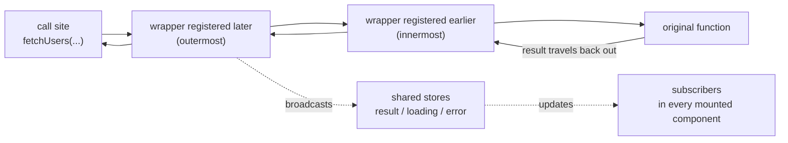

# React Toolroom

> A zero-dependency React toolset: runtime memoization without `useCallback`, and composable data-fetching hooks without a Provider.

[English](./README.md) | [中文](./README-zh_CN.md)

## Highlights

- **Zero dependencies, tiny footprint** — `react-toolroom` is 1.4 kB and `react-toolroom/async` is 3.02 kB (minified + brotli, including the shared chunk), enforced by CI budgets of 2 kB / 4 kB.
- **No Provider, no Context** — every hook works standalone; state lives on the functions you pass in, so there is nothing to mount at the app root.
- **Atomic, composable hooks** — each capability is one small hook. Combine `useCache` + `useDedup` + `usePolling` like building blocks, and tree-shake the rest.
- **Cross-component injection** — any component can attach middleware (wrappers) to another component's fetcher via the onion model; wrappers are removed automatically on unmount.
- **React 16.8 – 19** — one code path, broad peer range.
- **TypeScript first** — authored in TypeScript, `.d.ts` generated from source; 162 tests.

## Install

```bash
npm i react-toolroom
```

Two entries: `react-toolroom` (core: `memo`, `stableHash`) and `react-toolroom/async` (data-fetching hooks).

## When to choose this library

React Toolroom does not try to be a full server-state manager. It gives you the highest-frequency 20% — caching, deduplication, polling, focus revalidation, cancellation — in under 4 kB with no Provider. This is an honest comparison:

| Capability | react-toolroom | TanStack Query | SWR | ahooks `useRequest` |
| --- | --- | --- | --- | --- |
| Runtime dependencies | **0** | 0 | 0 | ahooks itself |
| Global Provider required | **No** | Yes (`QueryClientProvider`) | No | No |
| Request deduplication | `useDedup` | built-in | built-in | ✗ (debounce/throttle only) |
| Polling | `usePolling` | `refetchInterval` | `refreshInterval` | `pollingInterval` |
| Refetch on focus | `useFocusRevalidate` | `refetchOnWindowFocus` | `revalidateOnFocus` | `refreshOnWindowFocus` |
| Invalidation linked to mutations | `useInvalidate` | `invalidateQueries` | manual `mutate` | manual |
| Infinite loading | ✗ | `useInfiniteQuery` | `useSWRInfinite` | `useInfiniteScroll` |
| Keep previous data on key change | **default** | `placeholderData: keepPreviousData` | `keepPreviousData: true` | ✗ |
| DevTools | `subscribeInjectEvents` (observation API) | ✅ | community | ✗ |
| SSR / hydration | ✗ | ✅ | ✅ | limited |
| Fetch middleware | onion wrappers, per component, no Provider | ✗ (query cache events only) | ✅ (via `SWRConfig`) | ✗ |
| React versions | **16.8 – 19** | 18+ (v5) | 16.11+ (v2) | 16.8+ (v3) |
| Bundle size¹ | **1.4 kB** + **3.02 kB** | ≈ 13 kB | ≈ 4 kB | ≈ 5 kB+ |

¹ Minified + compressed, entry point only. react-toolroom numbers are exact and enforced by CI; competitor numbers are approximate and vary by version — check their docs.

**Choose react-toolroom** for small-to-mid applications, for embedding inside a component library, or when you only want to cherry-pick a few capabilities at minimal cost. **Choose TanStack Query** when you need complete server-state management — managed mutations with optimistic updates, cache-wide invalidation by query-key predicates, infinite queries, SSR hydration, DevTools panels.

## Quick start

### Core: `memo`, the `useCallback`-free `React.memo`

```tsx
import {memo} from 'react-toolroom';

const MemoSendButton = memo(SendButton);

function Chat() {
  const [text, setText] = useState('');
  const [messages, setMessages] = useState<string[]>([]);

  // `onClick` is a brand-new function on every render, yet the memoized
  // button skips re-rendering while the user types — no `useCallback`.
  return (
    <>
      <textarea value={text} onChange={(e) => setText(e.target.value)} />
      <MemoSendButton onClick={() => setMessages([...messages, text])} />
    </>
  );
}
```

`memo` stabilizes function props that look like event handlers (`/^on[A-Z]/` by default) and forwards to the latest handler on call, so the child sees a stable identity while your closures stay fresh.

### Async: compose hooks around one injectable

```tsx
import {
  useError,
  useInitialLoading,
  useInjectable,
  useResult,
  useRun
} from 'react-toolroom/async';
import {fetchList} from './services/user';

function UserList() {
  // 1. Make the fetcher injectable (a hook — call it before the hooks below).
  const fetchUsers = useInjectable(fetchList);

  // 2. Add capabilities in any order; each hook registers one wrapper.
  useRun(fetchUsers, []); // run once on mount
  const users = useResult(fetchUsers);
  const initialLoading = useInitialLoading(fetchUsers);
  const error = useError(fetchUsers);

  if (initialLoading) return <p>loading…</p>;
  if (error) return <p>{error.message}</p>;

  return (
    <ul>
      {users?.map((user) => (
        <li key={user.id}>{user.username}</li>
      ))}
    </ul>
  );
}
```

## `memo` and the React Compiler

The [React Compiler](https://react.dev/learn/react-compiler) reached 1.0 and became stable in October 2025. It memoizes automatically **at build time**: you add the compiler to your build, and it rewrites components so their values keep stable identities.

`react-toolroom/memo` is a **runtime, zero-configuration** solution — a drop-in replacement for `React.memo` that stabilizes event-handler props. They do not conflict, and `memo` stays useful wherever the compiler cannot help:

- **Projects not on the compiler toolchain** — legacy codebases, gradual migrations, builds where adding the Babel plugin is not (yet) an option.
- **Components the compiler skips** — the compiler bails out on patterns it cannot statically analyze; those components keep re-rendering unless memoized by hand.
- **Library code published un-compiled** — your app's compiler does not process `node_modules`, so a component library shipped as plain JS still benefits from stabilizing the handler props it receives.
- **Broad React range** — `memo` works on React 16.8 through 19 with one code path.

If you run the compiler, keep it: it covers derived data inside components. `memo` covers handler identity across component boundaries — a layer the compiler only fixes for code it actually compiles.

## The injection mechanism (onion model)

`useInjectable(fn)` returns a function with the same signature as `fn` whose identity is stable across renders. Calling it runs the original function through every registered wrapper — outermost first, innermost last, closest to the original function:



Every capability hook — `useResult`, `useLoading`, `useCache`, `useDedup`, … — is just a `useInject` registration, which is why they compose in any order. Wrappers are registered **once per hook instance** (re-renders and StrictMode double-renders cannot duplicate them) and are **removed automatically when the injecting component unmounts**.

Because the wrapper list lives on the injectable itself, a component can attach behavior to a fetcher created by *another* component — cross-component injection with no Provider:

```tsx
import {useInject, useInjectable} from 'react-toolroom/async';
import {fetchList} from './services/user';

// A custom wrapper: receives the next inner function, returns a replacement.
function withTiming() {
  return (f: typeof fetchList) => async (...args) => {
    const start = performance.now();
    try {
      return await f(...args);
    } finally {
      console.log(`fetchUsers took ${performance.now() - start}ms`);
    }
  };
}

function UserList({fetchUsers}: {fetchUsers: typeof fetchList}) {
  useInject(fetchUsers, withTiming());
  // …useResult / useRun / render…
}

function DevProbe({fetchUsers}: {fetchUsers: typeof fetchList}) {
  // Attaches a wrapper to a fetcher it does not own.
  // Removed automatically when <DevProbe /> unmounts.
  useInject(fetchUsers, (f) => async (...args) => {
    const users = await f(...args);
    console.log('fetched', users.length, 'users');
    return users;
  });
  return null;
}

function UsersPage() {
  const fetchUsers = useInjectable(fetchList);
  return (
    <>
      <UserList fetchUsers={fetchUsers} />
      {import.meta.env.DEV && <DevProbe fetchUsers={fetchUsers} />}
    </>
  );
}
```

A wrapper receives `(nextFn, callContext)`: `nextFn` is the next inner layer to call, and `callContext` is a fresh object per call — when `useRun` runs with `{signal: true}`, the trailing `AbortSignal` is exposed as `callContext.signal` so deeper wrappers can observe cancellation. For state shared across calls, `getInjectContext(fetchUsers)` returns the injectable's stable context object (this is where the result and loading stores live). `useInjectBefore` is the advanced variant: it inserts the wrapper at the head of the chain instead of the tail, so it is applied before previously registered wrappers and ends up as the innermost layer, closest to the original function.

Registration does not require a hook. The injection module also exposes `addWrapper(fn, wrapper)` — the non-hook primitive with the `InjectWrapper<F>` signature `(f, callContext) => f` — which pushes onto the same chain and returns an unsubscribe function; `subscribeInjectEvents` is nothing more than a thin observer built on top of it, which is how non-React tooling (log panels, devtools) taps into a chain. In the other direction, `useRun` does not even require an injectable: it probes its argument with `isInjectable(fn)` up front, and plain functions skip the wrapper machinery entirely while keeping the same run-on-change behavior.

## Recipes

### Deduplicate rapid clicks — `useDedup`

```tsx
const loadReport = useInjectable(fetchReport);
useDedup(loadReport);
const report = useResult(loadReport);

// The API takes 2 s. Clicking 5 times while it is in flight sends ONE
// request; every concurrent caller receives the same result.
<button type='button' onClick={() => loadReport()}>Refresh</button>;
```

Keys default to `stableHash`, which is insertion-order independent and maps every `AbortSignal` to a fixed placeholder — so reruns from `useRun(fn, args, {signal: true})` still dedupe. Entries are dropped when the promise settles, which means a failed call can be retried.

### Poll and revalidate on focus — `usePolling` + `useFocusRevalidate`

```tsx
const statCache = createMemoryCacheProvider<FocusStat, any[]>({cacheTime: 60000});

function Dashboard() {
  const loadStat = useInjectable(fetchFocusStat);
  const isStale = useCache(loadStat, statCache, 5000); // fresh for 5 s
  useFocusRevalidate(loadStat); // refetch on window focus / tab re-visible
  useRun(loadStat, []);
  const stat = useResult(loadStat);
  // Switch away for > 5 s, come back: cached data renders instantly,
  // a background revalidation follows.
}

// Polling lives in a child so mounting/unmounting starts/stops the timer
// (hooks cannot be called conditionally).
function Ticker() {
  const loadTicker = useInjectable(fetchTicker);
  useRun(loadTicker, []);
  usePolling(loadTicker, 3000); // every 3 s
  const ticker = useResult(loadTicker);
}
```

`usePolling` skips a tick while the previous call is still pending (a slow API never piles up concurrent requests) and pauses while the document is hidden unless you pass `{whenHidden: true}`. `useFocusRevalidate` throttles with `{interval}` (default `0`). Both also take `{args}`: when the fetcher is keyed (`useRun(loadUser, [userId])`), pass the same tuple — `usePolling(loadUser, 10000, {args: [userId]})` — so every tick resolves to the same `useCache`/`useDedup` key instead of opening a second request line keyed by `[]`.

### Cancel stale requests — `useRun` with a signal

```tsx
const loadDetail = useInjectable((detailId: number, signal: AbortSignal) =>
  fetchDetail(detailId, signal)
);

// Each run appends a fresh AbortSignal as the last argument; the previous
// signal is aborted when `id` changes or the component unmounts.
useRun(loadDetail, [id], {signal: true});

const loading = useLoading(loadDetail);
const detail = useResult(loadDetail);
const error = useError(loadDetail); // aborted calls reject with AbortError
```

Combine with `useCatch` to keep showing the previous data instead of an error when a request is superseded. `useRun` also accepts plain (non-injectable) functions.

### Cache with stale-while-revalidate — `useCache`

```tsx
// Module scope: createMemoryCacheProvider is not a hook, so the cache can
// be shared by every component that imports it.
const userCache = createMemoryCacheProvider<User[], any[]>({cacheTime: 10000});

function UserList() {
  const fetchUsers = useInjectable(fetchList);
  const isStale = useCache(fetchUsers, userCache, 2000); // staleTime: 2 s
  const users = useResult(fetchUsers);
  useRun(fetchUsers, []);

  return isStale ? <UserListSkeleton users={users} /> : <UserTable users={users} />;
}
```

On a cache hit, the cached value is broadcast to every subscriber **immediately** — components render data without waiting for the network. If it is older than `staleTime` (default `0`: every hit revalidates), a background refetch follows and updates everyone when it lands; its failures are swallowed so stale data stays on screen. With defaults, `createMemoryCacheProvider()` keeps entries forever (`cacheTime: Infinity`) and hashes keys with `stableHash`; when a finite `cacheTime` is set, the cache clears itself once no component has used it for that long. The returned `stale` flag is shared state too: every `useCache` consumer of the same injectable reads one broadcast flag and updates together, the last staleness verdict winning.

### Invalidate after a mutation — `useInvalidate`

```tsx
const userCache = createMemoryCacheProvider<User[], any[]>({cacheTime: 10000});

function UserList() {
  const fetchUsers = useInjectable(fetchList);
  useCache(fetchUsers, userCache, 5000);
  const invalidateUsers = useInvalidate(fetchUsers, userCache);
  const users = useResult(fetchUsers);
  useRun(fetchUsers, []);

  async function handleRename(user: User, name: string) {
    await renameUser(user.id, name);      // the mutation
    await invalidateUsers();              // then refresh the list
  }

  // …render `users`, wire `handleRename` to your edit form…
}
```

Unlike a stale-while-revalidate background refetch — which keeps serving the old value while refreshing — `useInvalidate` is a hard invalidation: it deletes the cache entry under the given args, then immediately re-runs the injectable with them, so subscribers see a fresh loading → result cycle instead of the pre-mutation data. The key linkage mirrors `useCache`: the same `cacheProvider` plus the same args tuple address the same entry (`useInvalidate(fetchUser, userCache)(userId)` drops what `useRun(fetchUser, [userId])` populated). The returned function is referentially stable and resolves to the fresh result, so `await` it in the mutation handler before closing your toast.

### `useLoading` vs `useInitialLoading`

```tsx
const initialLoading = useInitialLoading(fetchUsers); // no data yet at all
const refreshing = useLoading(fetchUsers);            // any call in flight
```

- `useLoading` — `true` while **any** call is in flight, initial load or background refresh.
- `useInitialLoading` — `true` only while a call is in flight **and no result exists yet** (fresh or cached). This is SWR's `isLoading` semantics: once any data is on screen, background refetches no longer count. Use it for the full-page skeleton; use `useLoading` for the "refreshing…" indicator.

### Suspend instead of a skeleton — `useSuspenseResult`

```tsx
import {Suspense} from 'react';

// The owner drives the fetch — OUTSIDE the Suspense boundary.
function UserList() {
  const fetchUsers = useInjectable(fetchList);
  useRun(fetchUsers, []);
  return (
    <Suspense fallback={<p>loading…</p>}>
      <UserTable fetchUsers={fetchUsers} />
    </Suspense>
  );
}

function UserTable({fetchUsers}: {fetchUsers: typeof fetchList}) {
  const users = useSuspenseResult(fetchUsers); // suspends until data exists
  // …render the table, no `undefined` branch, no skeleton…
}
```

`useSuspenseResult` throws the in-flight promise instead of returning `undefined`, so declarative fallback UI replaces manual loading flags. It only reads — starting the fetch stays the job of `useRun`, polling, or a manual call. ⚠️ The driver must live in a parent **outside** the `<Suspense>` boundary: a suspended subtree never commits, so its effects never run — calling `useRun` and `useSuspenseResult` in the *same* component deadlocks (the call that would end the suspension never starts). Once the first result has landed, every later result flows in through the shared result store exactly like `useResult`.

### Keep previous data while paging

```tsx
function UserList() {
  const [page, setPage] = useState(1);
  const loadUsers = useInjectable((query: {page: number}) => fetchUsers(query));

  // `hash` compares args structurally, so only a real page change re-runs.
  useRun(loadUsers, [{page}], {hash: stableHash});

  const users = useResult(loadUsers);    // still the previous page while the new one loads
  const loading = useLoading(loadUsers); // true — show a small indicator, not a skeleton

  return (
    <div>
      {loading && <p>loading…</p>}
      <ul>
        {users?.map((u) => (
          <li key={u.id}>{u.username}</li>
        ))}
      </ul>
      <button type='button' disabled={page === 1} onClick={() => setPage(page - 1)}>
        Prev
      </button>
      <button type='button' onClick={() => setPage(page + 1)}>
        Next
      </button>
    </div>
  );
}
```

When `page` changes, the previous page stays on screen until the new result lands: the shared result store is never reset between calls, and a per-call sequence ticket drops the result of any call older than the latest applied one — a slow request can't clobber the data a newer call already delivered. TanStack Query needs `placeholderData: keepPreviousData` and SWR needs `keepPreviousData: true` for this; here it is the default, no option required. Pair it with `useInitialLoading` for the very first load (full-page skeleton) and `useCache` to revisit a page instantly from cache while it revalidates in the background.

### Observe every call — `subscribeInjectEvents`

```tsx
const fetchUsers = useInjectable(fetchList);

// A zero-dependency call trace — no DevTools panel required.
const stop = subscribeInjectEvents(fetchUsers, {
  onCall: (args) => console.log('→ fetchUsers', ...args),
  onSettle: ({args, result, error, duration}) =>
    console.log('← fetchUsers', {args, result, error, duration})
});
// stop() removes the observer again.
```

`subscribeInjectEvents` is a plain function, not a hook — register from an effect, a module, or the browser console. The observer is registered as the outermost wrapper, so `onSettle` fires exactly once per call with `{args, result | error, duration}` where `duration` measures the entire onion chain it observes (original function plus every wrapper registered before the subscription). A minimal log panel is just state on top: push each settle event into an array and render it. For a runnable tour of the same onion model — cross-component injection, layer order, automatic removal on unmount — see the demo at [`demos/views/Async/Inject.tsx`](./demos/views/Async/Inject.tsx).

## API reference

### Core — `react-toolroom`

| API | Description |
| --- | --- |
| `memo(Component, options?)` | `React.memo` that auto-memoizes event-handler props, removing the need for `useCallback`. `options`: `{testEvent?, propsAreEqual?}` or a bare `propsAreEqual(prev, next)` function. |
| `memoBase(Component, {testEvent, propsAreEqual?})` | Lower-level variant that requires the full options object (no defaults filled in). |
| `defaultTestEvent(key)` | The default `testEvent`: `/^on[A-Z]/.test(key)`. |
| `stableHash(value)` | Structural hash: sorted object keys, `Map`/`Set` aware, circular-reference safe, `AbortSignal` → fixed placeholder. Exported from both entries; the default `hash` of `useDedup` and `createMemoryCacheProvider`, and a building block for your own keys, e.g. `hash: (args) => 'user:' + stableHash(args)`. |
| `isAbortSignal(value)` | `true` for `AbortSignal`s: an `instanceof` fast path plus a duck-typing fallback (`aborted` property + `addEventListener` function), so the check survives cross-realm signals (iframes, test doubles) and environments without a global `AbortSignal`. Exported from both entries; the basis of `stableHash`'s signal placeholder and `useRun`'s signal bridge. |

### Async — `react-toolroom/async`

| API | Description |
| --- | --- |
| `useInjectable(fn)` | Turn any function into an injectable with a per-instance wrapper chain; the returned identity is stable across renders. |
| `isInjectable(fn)` | `true` when `fn` was created by `useInjectable` — the probe `useRun` uses to accept plain (non-injectable) functions, also handy for your own wrappers. |
| `useInject(fn, wrapper)` | Register `wrapper: (nextFn, callContext) => nextFn` on an injectable; registered once per hook instance, removed on unmount. |
| `useInjectBefore(fn, wrapper)` | Advanced API: insert the wrapper at the head of the chain — applied before previously registered wrappers, ending up as the innermost layer, closest to the original function. |
| `getInjectContext(fn)` | The injectable's stable context object — where wrappers keep state shared across calls. |
| `subscribeInjectEvents(fn, {onCall, onSettle})` | Non-hook observation API for devtools/log panels: `onCall(args)` fires before the chain runs, `onSettle({args, result?, error?, duration})` fires once per call, `duration` covering the whole onion chain below the observer. Returns an unsubscribe function. |
| `useResult(fn, init?)` | Subscribe to the latest result; results broadcast to every consumer, and late subscribers start from the shared last result. |
| `useSuspenseResult(fn)` | Like `useResult`, but suspends — throws the in-flight promise — until the first result exists. Requires a `<Suspense>` boundary, and the fetch driver (`useRun` or a manual call) must live in a parent outside it. After the first result, updates flow in exactly like `useResult`. |
| `useLoading(fn)` | `true` while any call is in flight. |
| `useInitialLoading(fn)` | `true` while a call is in flight and no result exists yet (SWR `isLoading`). |
| `useError(fn)` | The last thrown error; cleared on success. |
| `useFailureCount(fn)` | Number of failures since the last success (reset on success). |
| `useCatch(fn, catcher)` | Convert rejections into fallback values via `catcher(e) => result`. |
| `useFinally(fn, handler)` | Run `handler` when a call settles, success or failure. |
| `useRetry(fn, shouldRetry)` | Retry on failure while `shouldRetry(failureCount, e)` returns `true`; returning a `Promise` waits for it, then retries (backoff). |
| `useRun(fn, args, options?)` | Run `fn(...args)` on mount and whenever `args` change. `{signal: true}` appends an `AbortSignal` as the last argument and aborts it on change/unmount. `{hash}` (e.g. `stableHash`) replaces the reference comparison with a structural key, so unstable references in `args` only re-run on real changes — the same key semantics as `useDedup`/`useCache`. Plain (non-injectable) functions are detected via `isInjectable` and run as-is. |
| `useCache(fn, cacheProvider, staleTime = 0)` | SWR caching: cache hits broadcast immediately; stale entries revalidate in the background. Returns whether the current data is stale — a broadcast flag shared by every `useCache` consumer of the injectable, updating together (last verdict wins). |
| `useInvalidate(fn, cacheProvider)` | Returns a stable `(...args) => Promise<R>` that deletes the cache entry under `args` and immediately re-runs the injectable with them — hard invalidation for mutation success paths. Keys link to `useCache` via the same provider and args tuple. |
| `createMemoryCacheProvider({cacheTime = Infinity, hash = stableHash})` | In-memory `CacheProvider` with `get/set/delete/clear/use`; idle-garbage-collects entries after `cacheTime` once unused. |
| `useDedup(fn, {hash = stableHash}?)` | Concurrent calls with the same key share one in-flight promise; the entry is dropped on settle, so failures are retryable. |
| `usePolling(fn, interval, {whenHidden = false, args = []}?)` | Call `fn(...args)` every `interval` ms; skips ticks while the previous call is pending; pauses while the document is hidden unless `whenHidden`. Changing `interval` restarts the timer. `args` land on the same `useCache`/`useDedup` key as `useRun(fn, args)` — pass the keyed tuple when `useRun` uses one. |
| `useFocusRevalidate(fn, {interval = 0, args = []}?)` | Refetch on window focus and on `visibilitychange` back to visible, throttled by `interval`; `args` are spread into every revalidation and keyed like `useRun`. |
| `stableHash(value)` | Re-exported here for convenience — see the core table above. |

For custom wrappers and cache providers, the entries also export the types you need: `react-toolroom/async` ships `AsyncFunc`, `Func`, `R<AF>`, `CacheProvider<R, Args>`, and `CacheResult<R>`; the core entry ships `Func`.

## Package facts

- **ESM-only** — the `exports` map ships `types` / `import` / `default` conditions pointing at `.mjs` files; there is no CJS build. If you target CJS/Node directly, bundle first.
- **CI size budgets** — [size-limit](./.size-limit.json) keeps `react-toolroom` under 2 kB and `react-toolroom/async` under 4 kB (brotli, entry + shared chunk). Currently 1.4 kB / 3.02 kB.
- **Tree-shakable** — `sideEffects: false`, two independent entries, atomic hooks: import one capability, pay for little else.
- **Peer dependencies** — `react` and `react-dom` `^16.8.0 || ^17.0.0 || ^18.0.0 || ^19.0.0`.
- **TypeScript first** — authored in TypeScript; type declarations are generated from source.
- **Tested** — 162 tests (vitest + Testing Library).

## Demos

See [demos](./demos/) for runnable examples: `memo`, request deduplication, polling, focus revalidation, SWR caching, cancellation via `AbortSignal`, and cross-component injection (onion model).

## Documentation

[API documentation](https://wmzy.github.io/react-toolroom/)

## Related Projects

- [painless](https://github.com/wmzy/painless) - Frontend template
- [native-router](https://github.com/native-router/react) - Routing

## Contributing

Contributions are always welcome!

## License

MIT
