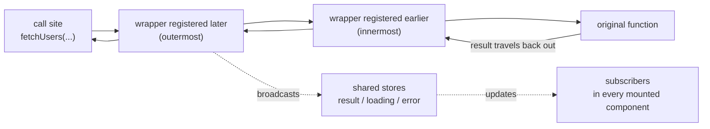

# React Toolroom

> A zero-dependency React toolset: runtime memoization without `useCallback`, and composable data-fetching hooks without a Provider.

[English](./README.md) | [中文](./README-zh_CN.md)

[](https://www.npmjs.com/package/react-toolroom)
[](https://github.com/wmzy/react-toolroom/actions/workflows/ci.yml)

## Highlights

- **Zero dependencies, tiny footprint** — the full entries are 1.4 kB (`react-toolroom`) and 5.64 kB (`react-toolroom/async`), minified + brotli, shared chunk included; both tree-shake, so your real cost is the capabilities you import, not the full entry.
- **No Provider, no Context** — every hook works standalone; state lives on the functions you pass in, so there is nothing to mount at the app root.
- **Atomic, composable hooks** — each capability is one small hook. Combine `useCache` + `useDedup` + `usePolling` like building blocks, and tree-shake the rest.
- **Cross-component injection** — any component can attach middleware (wrappers) to another component's fetcher via the onion model; wrappers are removed automatically on unmount.
- **React 16.8 – 19** — one code path, broad peer range.
- **TypeScript first** — authored in TypeScript, `.d.ts` generated from source; 233 tests.

## Install

```bash
npm i react-toolroom
```

Two entries: `react-toolroom` (core: `memo`, `stableHash`) and `react-toolroom/async` (data-fetching hooks).

## When to choose this library

React Toolroom does not try to be a full server-state manager. It gives you the highest-frequency 20% — caching, deduplication, polling, focus and reconnect revalidation, cancellation, mutation-linked invalidation — in ~5.6 kB with no Provider (less when you cherry-pick). This is an honest comparison:

| Capability | react-toolroom | TanStack Query | SWR | ahooks `useRequest` |
| --- | --- | --- | --- | --- |
| Runtime dependencies | **0** | 0 | 0 | ahooks itself |
| Global Provider required | **No** | Yes (`QueryClientProvider`) | No | No |
| Request deduplication | built-in (`load` on the cache provider; `useDedup` for uncached injectables) | built-in | built-in | ✗ (debounce/throttle only) |
| Polling | `usePolling` | `refetchInterval` | `refreshInterval` | `pollingInterval` |
| Refetch on focus | `useFocusRevalidate` | `refetchOnWindowFocus` | `revalidateOnFocus` | `refreshOnWindowFocus` |
| Refetch on reconnect | `useReconnectRevalidate` | built-in | built-in | ✗ |
| Mutation lifecycle | `useMutation` | `useMutation` | `useSWRMutation` | manual |
| Invalidation linked to mutations | `useInvalidate` / `invalidates` | `invalidateQueries` | manual `mutate` | manual |
| Infinite loading | ✅ `useInfinite` | `useInfiniteQuery` | `useSWRInfinite` | `useInfiniteScroll` |
| Keep previous data on key change | **default** + `usePlaceholderData` flag | `placeholderData: keepPreviousData` | `keepPreviousData: true` | ✗ |
| DevTools | ✅ `InjectDevTools` panel (separate entry) | ✅ | community | ✗ |
| SSR / hydration | ✅ `dehydrate`/`hydrate` | ✅ | ✅ | limited |
| Fetch middleware | onion wrappers, per component, no Provider | ✗ (query cache events only) | ✅ (via `SWRConfig`) | ✗ |
| React versions | **16.8 – 19** | 18+ (v5) | 16.11+ (v2) | 16.8+ (v3) |
| Bundle size¹ | **1.4 kB** + **5.64 kB** | ≈ 13 kB | ≈ 4 kB | ≈ 5 kB+ |

¹ Minified + compressed, full entry without tree-shaking — an upper bound; cherry-picked imports are smaller. react-toolroom numbers are exact, measured from the CI build; competitor numbers are approximate and vary by version — check their docs.

**Choose react-toolroom** for small-to-mid applications, for embedding inside a component library, or when you only want to cherry-pick a few capabilities at minimal cost. **Choose TanStack Query** when you want a managed server-state client — cache-wide invalidation by query-key predicates, mutation-to-query coordination handled by the client itself, persistence plugins, and its full DevTools.

## Write your project's query hook once

React Toolroom ships no configurable preset hook — there is no `useQuery(options)`. That is deliberate: an options surface that re-encodes what the atomic hooks already express directly costs as much to maintain as the composition itself, and it hides the mechanism at exactly the moment you need to see it. Instead, write your project's query hook **once**, then use it everywhere — modifying that composition later is no more work than editing a config object.

The [`recipes/`](./recipes/) directory holds copy-and-customize templates to start from:

| Template | Composition |
| --- | --- |
| [`useProjectQuery.ts`](./recipes/useProjectQuery.ts) | The base: `useInjectable` + `useDedup` + `useRun(…, {signal: true})` + `useResult` / `useInitialLoading` / `useError`. |
| [`useProjectMutation.ts`](./recipes/useProjectMutation.ts) | The write side, on top of the first-class `useMutation`: pins the project's default failure reporting while an explicit `onError` still replaces it — the pattern for adding a house convention to a library hook. |
| [`useProjectSWRQuery.ts`](./recipes/useProjectSWRQuery.ts) | Adds `useCache(staleTime)` over a module-level cache instance + `useFocusRevalidate`. |
| [`useProjectPollingQuery.ts`](./recipes/useProjectPollingQuery.ts) | Adds `usePolling` on a fixed interval. |
| [`useProjectPaginatedQuery.ts`](./recipes/useProjectPaginatedQuery.ts) | Keyed `useRun(fn, [{page}], {hash: stableHash})` with default keep-previous-data made observable by `usePlaceholderData`, `useLoading` as the small refresh indicator and `useInitialLoading` as the first-screen skeleton. |
| [`createLocalCacheProvider.ts`](./recipes/createLocalCacheProvider.ts) | A `CacheProvider` that persists entries to `localStorage` — for caches that should survive a page reload instead of rebuilding from scratch. |

Copy the one closest to your screen, swap in your fetcher, and adjust the common customization points each file header calls out: `staleTime`, error reporting, the cache instance, and the return shape. One hook gives every screen a single loading/error contract — and exactly one place to change it.

For the server side of the story — priming caches in the App Router, hydration, and what does and does not work inside React Server Components — see the [Next.js / RSC integration guide](./docs/nextjs-rsc.md).

## Quick start

### Core: `memo`, the `useCallback`-free `React.memo`

```tsx
import {memo} from 'react-toolroom';

const MemoSendButton = memo(SendButton);

function Chat() {
  const [text, setText] = useState('');
  const [messages, setMessages] = useState<string[]>([]);

  // `onClick` is a brand-new function on every render, yet the memoized
  // button skips re-rendering while the user types — no `useCallback`.
  return (
    <>
      <textarea value={text} onChange={(e) => setText(e.target.value)} />
      <MemoSendButton onClick={() => setMessages([...messages, text])} />
    </>
  );
}
```

`memo` stabilizes function props that look like event handlers (`/^on[A-Z]/` by default) and forwards to the latest handler on call, so the child sees a stable identity while your closures stay fresh.

### Async: compose hooks around one injectable

```tsx
import {
  useError,
  useInitialLoading,
  useInjectable,
  useResult,
  useRun
} from 'react-toolroom/async';
import {fetchList} from './services/user';

function UserList() {
  // 1. Make the fetcher injectable (a hook — call it before the hooks below).
  const fetchUsers = useInjectable(fetchList);

  // 2. Add capabilities in any order; each hook registers one wrapper.
  useRun(fetchUsers, []); // run once on mount
  const users = useResult(fetchUsers);
  const initialLoading = useInitialLoading(fetchUsers);
  const error = useError(fetchUsers);

  if (initialLoading) return <p>loading…</p>;
  if (error) return <p>{error.message}</p>;

  return (
    <ul>
      {users?.map((user) => (
        <li key={user.id}>{user.username}</li>
      ))}
    </ul>
  );
}
```

### DevTools: mount a call-trace panel

```tsx
import {InjectDevTools} from 'react-toolroom/devtools';

// Dev-only, anywhere in the tree — separate entry, inline styles, zero deps.
<InjectDevTools injectables={[fetchUsers]} />
```

## `memo` and the React Compiler

The [React Compiler](https://react.dev/learn/react-compiler) reached 1.0 and became stable in October 2025. It memoizes automatically **at build time**: you add the compiler to your build, and it rewrites components so their values keep stable identities.

`react-toolroom/memo` is a **runtime, zero-configuration** solution — a drop-in replacement for `React.memo` that stabilizes event-handler props. They do not conflict, and `memo` stays useful wherever the compiler cannot help:

- **Projects not on the compiler toolchain** — legacy codebases, gradual migrations, builds where adding the Babel plugin is not (yet) an option.
- **Components the compiler skips** — the compiler bails out on patterns it cannot statically analyze; those components keep re-rendering unless memoized by hand.
- **Library code published un-compiled** — your app's compiler does not process `node_modules`, so a component library shipped as plain JS still benefits from stabilizing the handler props it receives.
- **Broad React range** — `memo` works on React 16.8 through 19 with one code path.

If you run the compiler, keep it: it covers derived data inside components. `memo` covers handler identity across component boundaries — a layer the compiler only fixes for code it actually compiles.

## The injection mechanism (onion model)

`useInjectable(fn)` returns a function with the same signature as `fn` whose identity is stable across renders. Calling it runs the original function through every registered wrapper — outermost first, innermost last, closest to the original function:



Every capability hook — `useResult`, `useLoading`, `useCache`, `useDedup`, … — is just a `useInject` registration, which is why they compose in any order. Wrappers are registered **once per hook instance** (re-renders and StrictMode double-renders cannot duplicate them) and are **removed automatically when the injecting component unmounts**.

Because the wrapper list lives on the injectable itself, a component can attach behavior to a fetcher created by *another* component — cross-component injection with no Provider:

```tsx
import {useInject, useInjectable} from 'react-toolroom/async';
import {fetchList} from './services/user';

// A custom wrapper: receives the next inner function, returns a replacement.
function withTiming() {
  return (f: typeof fetchList) => async (...args) => {
    const start = performance.now();
    try {
      return await f(...args);
    } finally {
      console.log(`fetchUsers took ${performance.now() - start}ms`);
    }
  };
}

function UserList({fetchUsers}: {fetchUsers: typeof fetchList}) {
  useInject(fetchUsers, withTiming());
  // …useResult / useRun / render…
}

function DevProbe({fetchUsers}: {fetchUsers: typeof fetchList}) {
  // Attaches a wrapper to a fetcher it does not own.
  // Removed automatically when <DevProbe /> unmounts.
  useInject(fetchUsers, (f) => async (...args) => {
    const users = await f(...args);
    console.log('fetched', users.length, 'users');
    return users;
  });
  return null;
}

function UsersPage() {
  const fetchUsers = useInjectable(fetchList);
  return (
    <>
      <UserList fetchUsers={fetchUsers} />
      {import.meta.env.DEV && <DevProbe fetchUsers={fetchUsers} />}
    </>
  );
}
```

A wrapper receives `(nextFn, callContext)`: `nextFn` is the next inner layer to call, and `callContext` is a fresh object per call — when `useRun` runs with `{signal: true}`, the trailing `AbortSignal` is exposed as `callContext.signal` so deeper wrappers can observe cancellation. For state shared across calls, `getInjectContext(fetchUsers)` returns the injectable's stable context object (this is where the result and loading stores live). `useInjectBefore` is the advanced variant: it inserts the wrapper at the head of the chain instead of the tail, so it is applied before previously registered wrappers and ends up as the innermost layer, closest to the original function.

Registration does not require a hook. The injection module also exposes `addWrapper(fn, wrapper)` — the non-hook primitive with the `InjectWrapper<F>` signature `(f, callContext) => f` — which pushes onto the same chain and returns an unsubscribe function; `subscribeInjectEvents` is nothing more than a thin observer built on top of it, which is how non-React tooling (log panels, devtools) taps into a chain. In the other direction, `useRun` does not even require an injectable: it probes its argument with `isInjectable(fn)` up front, and plain functions skip the wrapper machinery entirely while keeping the same run-on-change behavior.

## Recipes

### Deduplicate rapid clicks — `useDedup`

```tsx
const loadReport = useInjectable(fetchReport);
useDedup(loadReport);
const report = useResult(loadReport);

// The API takes 2 s. Clicking 5 times while it is in flight sends ONE
// request; every concurrent caller receives the same result.
<button type='button' onClick={() => loadReport()}>Refresh</button>;
```

Keys default to `stableHash`, which is insertion-order independent and maps every `AbortSignal` to a fixed placeholder — so reruns from `useRun(fn, args, {signal: true})` still dedupe. Entries are dropped when the promise settles, which means a failed call can be retried.

> **Redundant alongside `createMemoryCacheProvider`.** The memory cache provider now deduplicates in-flight requests itself (`load`, below) — and `useCache` routes every fetch through it — so stacking `useDedup` on a cached injectable adds nothing: same args in flight → one request either way. `useDedup` remains the tool for *custom* providers (localStorage, IndexedDB, no-op stubs) that do not implement `load`, or for deduping an injectable that is not cached at all.

### Poll and revalidate on focus — `usePolling` + `useFocusRevalidate`

```tsx
const statCache = createMemoryCacheProvider<FocusStat, any[]>({cacheTime: 60000});

function Dashboard() {
  const loadStat = useInjectable(fetchFocusStat);
  const isStale = useCache(loadStat, statCache, 5000); // fresh for 5 s
  useFocusRevalidate(loadStat); // refetch on window focus / tab re-visible
  useRun(loadStat, []);
  const stat = useResult(loadStat);
  // Switch away for > 5 s, come back: cached data renders instantly,
  // a background revalidation follows.
}

// Polling lives in a child so mounting/unmounting starts/stops the timer
// (hooks cannot be called conditionally).
function Ticker() {
  const loadTicker = useInjectable(fetchTicker);
  useRun(loadTicker, []);
  usePolling(loadTicker, 3000); // every 3 s
  const ticker = useResult(loadTicker);
}
```

`usePolling` skips a tick while the previous call is still pending (a slow API never piles up concurrent requests) and pauses while the document is hidden unless you pass `{whenHidden: true}`. `useFocusRevalidate` throttles with `{interval}` (default `0`). Both also take `{args}`: when the fetcher is keyed (`useRun(loadUser, [userId])`), pass the same tuple — `usePolling(loadUser, 10000, {args: [userId]})` — so every tick resolves to the same `useCache`/`useDedup` key instead of opening a second request line keyed by `[]`.

### Cancel stale requests — `useRun` with a signal

```tsx
const loadDetail = useInjectable((detailId: number, signal: AbortSignal) =>
  fetchDetail(detailId, signal)
);

// Each run appends a fresh AbortSignal as the last argument; the previous
// signal is aborted when `id` changes or the component unmounts.
useRun(loadDetail, [id], {signal: true});

const loading = useLoading(loadDetail);
const detail = useResult(loadDetail);
const error = useError(loadDetail); // aborted calls reject with AbortError
```

Combine with `useCatch` to keep showing the previous data instead of an error when a request is superseded. `useRun` also accepts plain (non-injectable) functions.

### Cache with stale-while-revalidate — `useCache`

```tsx
// Module scope: createMemoryCacheProvider is not a hook, so the cache can
// be shared by every component that imports it.
const userCache = createMemoryCacheProvider<User[], any[]>({cacheTime: 10000});

function UserList() {
  const fetchUsers = useInjectable(fetchList);
  const isStale = useCache(fetchUsers, userCache, 2000); // staleTime: 2 s
  const users = useResult(fetchUsers);
  useRun(fetchUsers, []);

  return isStale ? <UserListSkeleton users={users} /> : <UserTable users={users} />;
}
```

On a cache hit, the cached value is broadcast to every subscriber **immediately** — components render data without waiting for the network. If it is older than `staleTime` (default `0`: every hit revalidates), a background refetch follows and updates everyone when it lands; its failures are swallowed so stale data stays on screen. With defaults, `createMemoryCacheProvider()` keeps entries forever (`cacheTime: Infinity`) and hashes keys with `stableHash`. When a finite `cacheTime` is set, reclamation is **per entry** (like TanStack Query's `gcTime`): every read or write refreshes the entry's clock, and an entry idle for the full `cacheTime` is deleted — with an in-flight request never collected. Two channels drive the sweep: the last unmounted `useCache` consumer schedules a final scan, and every write debounce-schedules one, so entries written by channels nobody mounts (a router loader priming the cache) are reclaimed too. The returned `stale` flag is shared state too: every `useCache` consumer of the same injectable reads one broadcast flag and updates together, the last staleness verdict winning.

Because every fetch `useCache` starts (a miss or a stale background revalidation) goes through the provider's `load`, concurrent consumers share one in-flight request — including consumers on *different* injectables, as long as they read the same provider with the same args. StrictMode double-mounts, two components fetching the same key in one commit, a router loader running the same read: one network request, one write-back.

### Read-through with in-flight sharing — `load` / `peek`

`createMemoryCacheProvider()` entries are **three-state**: settled data, an in-flight request, or both (stale data served while a background revalidation runs). Two provider methods expose that machinery directly — this is the seam a router loader uses to share a cache with `useCache`:

```tsx
const userCache = createMemoryCacheProvider<User, [string]>({cacheTime: 60000});

// Router loader channel: read-through with in-flight dedup.
const user = await userCache.load([id], () => api.user(id));
// Same args while that request is pending — from this loader, a useCache
// consumer, anything — share the very same promise; the factory runs once.

// Synchronous peek: settled data or undefined. Never observes an
// in-flight request, never starts one — safe for render-time checks.
const cached = userCache.peek([id]); // {value, cachedAt} | undefined
```

- **`load(args, factory)`** — atomic get-or-insert of the in-flight slot: an existing pending request for the same key is returned as-is (`factory` not invoked), otherwise `factory()` runs once and is registered. When it settles, the provider writes the result back itself. A per-key **generation counter**, bumped by every write (`set`/`delete`/`deletePrefix`/`deleteWhere`, wiped by `clear`), guards the write-back: if anything wrote to the key while the request was in flight — a mutation's write-through, an invalidation — the late response is dropped instead of clobbering the newer value. `cachedAt` is stamped **from settlement**, not from when the request started, so a slow response does not eat into the data's `cacheTime`/`staleTime` budget. A rejection vacates the slot, keeps any previously settled data (SWR: a failed background refetch leaves the stale value on screen) and rethrows to the caller as-is.
- **`peek(args)`** — reads the settled entry (`{value, cachedAt}` or `undefined`) without observing in-flight requests and without ever creating one: checking the cache can never trigger a fetch. (`get` also reads only settled data, but as the tuple `[value, cachedAt]`; `peek` is the object-shaped, request-free contract non-React channels program against.)

In-flight state is deliberately invisible to `get`/`peek`/`dehydrate`/`snapshot` data rows — only settled data is ever "the cache". `snapshot()` marks entries that additionally have a request running with an additive `pending: true`.

### Invalidate after a mutation — `useInvalidate`

```tsx
const userCache = createMemoryCacheProvider<User[], any[]>({cacheTime: 10000});

function UserList() {
  const fetchUsers = useInjectable(fetchList);
  useCache(fetchUsers, userCache, 5000);
  const invalidateUsers = useInvalidate(fetchUsers, userCache);
  const users = useResult(fetchUsers);
  useRun(fetchUsers, []);

  async function handleRename(user: User, name: string) {
    await renameUser(user.id, name);      // the mutation
    await invalidateUsers();              // then refresh the list
  }

  // …render `users`, wire `handleRename` to your edit form…
}
```

Unlike a stale-while-revalidate background refetch — which keeps serving the old value while refreshing — `useInvalidate` is a hard invalidation: it deletes the cache entry under the given args, then immediately re-runs the injectable with them, so subscribers see a fresh loading → result cycle instead of the pre-mutation data. The key linkage mirrors `useCache`: the same `cacheProvider` plus the same args tuple address the same entry (`useInvalidate(fetchUser, userCache)(userId)` drops what `useRun(fetchUser, [userId])` populated). The returned function is referentially stable and resolves to the fresh result, so `await` it in the mutation handler before closing your toast.

### Optimistic update — `useOptimistic`

```tsx
function TodoList() {
  const fetchTodos = useInjectable(fetchAllTodos);
  const saveTodo = useInjectable((todo: Todo) => api.save(todo));

  // Same injectable as the mutation itself: the snapshot derives from the
  // current result and the call args.
  useOptimistic(saveTodo, (draft, todo) => ({
    ...draft,
    items: [...draft.items, todo] // optimistic append
  }));
  const todos = useResult(fetchTodos);
  useRun(fetchTodos, []);

  const error = useError(saveTodo); // rollbacks still surface the error

  async function handleAdd(todo: Todo) {
    await saveTodo(todo); // resolves to the server truth
  }

  // …render `todos`, wire `handleAdd` to the input…
}
```

`useOptimistic` is optimistic UI: each call of the wrapped injectable immediately publishes a snapshot computed by the updater from the current result and the call args, then lets the real call run — success overwrites the snapshot with the server truth through the normal result broadcast, failure rolls the store back to the pre-call value while the rejection keeps flowing (`useError` still catches it). Pair it with `useInvalidate` for the split that matters: optimistic snapshots for edits you can predict locally (toggles, appends, renames — instant feedback, zero extra requests), hard invalidation for data you cannot compute yourself (a mutation that reshapes a list rendered elsewhere). Return a **new** value from the updater: returning nothing keeps the previous value, so mutating `draft` in place neither re-renders nor leaves anything to roll back to.

### SSR: dehydrate and hydrate

```tsx
const userCache = createMemoryCacheProvider<User, [string]>({cacheTime: 60000});

// Server: prime the cache during prefetch, then serialize it into the HTML.
userCache.set([id], await fetchUser(id));
const payload = userCache.dehydrate(); // plain, JSON-safe object
// e.g. `<script id="cache" type="application/json">${JSON.stringify(payload)}</script>`

// Client: restore before the first render.
userCache.hydrate(JSON.parse(document.getElementById('cache')!.textContent!));

function User({id}: {id: string}) {
  const fetchUser = useInjectable((signal) => api.user(id, signal));
  const isStale = useCache(fetchUser, userCache, 5000);
  useRun(fetchUser, [id]);
  // …
}
```

`dehydrate()` flattens the internal map into a plain `{[hashedKey]: [value, timestamp]}` object — `JSON.stringify`-safe, so it can travel through HTML, props, or a hand-rolled RPC. On the client, call `hydrate(payload)` **before** the first render: the first `useCache` lookup is then a cache hit and paints immediately; entries older than `staleTime` are revalidated in the background, exactly like any normal stale hit. `hydrate` **merges** — it never clears entries the client already holds — and timestamps survive the trip, so staleness math stays correct.

### Prefix invalidation

```tsx
// Hash convention: namespace each entity's keys with a prefix.
const cache = createMemoryCacheProvider<unknown, any[]>({
  hash: (args) => 'user:' + stableHash(args)
});

// One line drops every user entry — and only user entries.
cache.deletePrefix('user:');
```

`delete(key)` and `useInvalidate` target exactly one entry. `deletePrefix(prefix)` batches: it walks the hashed keys and removes every one starting with `prefix`. Pair it with a `hash` convention (`'user:' + stableHash(args)`) and a mutation that can affect many cached users at once — say a role change for a whole team — invalidates the entire `user:` namespace without touching `post:` or any other prefix. The removal fires the same deletion event `invalidate` does, so mounted `useCache` consumers refetch — no extra wiring.

### Declare what a mutation invalidates — `invalidates` / `invalidate`

`useInvalidate` is imperative: you call the invalidator yourself in the success handler. `invalidates` is the same flow declared where the mutation lives — the library runs it on success, and only on success:

```tsx
// Module-level caches — invalidation targets them directly, so the editor
// component never needs a reference to any injectable.
const feedCache = createMemoryCacheProvider<Article[], any[]>({cacheTime: 60000});
const articleCache = createMemoryCacheProvider<Article, any[]>({cacheTime: 60000});

function Editor({slug}: Props) {
  const [save, {isMutating}] = useMutation(saveArticle, {
    invalidates: [
      feedCache,               // (a) the whole provider
      [articleCache, slug]     // (b) by prefix: entries whose args start with slug
    ]
  });
  // save() resolves → both caches are purged and every mounted useCache
  // consumer of them refetches and re-broadcasts. A rejected save
  // invalidates nothing.
}

// The imperative twin, for non-mutation moments (a websocket push, a
// logout, a manual refresh button):
invalidate([feedCache]);
```

Invalidation addresses the **cache provider**, not any injectable: providers are the data's home (usually module constants), while injectables — hook-instance identities that are awkward to pass across the tree — own only the state broadcasts. The prefix args are type-checked element-wise against the provider's key tuple at compile time. Per target:

1. **Purge.** A bare provider clears outright. A `[provider, ...argsPrefix]` tuple removes exactly the entries whose raw args tuple structurally extends the prefix — `[feedCache, 'news']` leaves the `sports` entries alone — via the provider's `deleteWhere`, which works under any `hash` convention because matching happens in args space. This is a pure cache operation: no injectable is touched, no request is issued, and no mounted consumer is required — which is also why an unmounted screen's entry can be purged with nothing but the provider in hand.
2. **Revalidate — passively.** `useCache` subscribes to its provider's deletion events. Whenever entries a consumer has seen are removed — by `invalidate`, the `invalidates` option, `deletePrefix`, a DevTools panel button, expiry, any writer — their tuples are re-run through the injectable's wrapper chain: a hard cache miss that refetches and broadcasts the fresh result to every subscriber, exactly like a focus revalidation. The shared `stale` flag rises first, so subscribers can render their refreshing indicator. One delete event, however many consumers, still means one refetch per args tuple (in-flight revalidations dedupe). With no mounted consumer nothing is re-run, but the purged cache already guarantees the next mount fetches fresh.

How this maps to TanStack Query's `invalidateQueries`:

| | `invalidates` / `invalidate` | TanStack `invalidateQueries` |
| --- | --- | --- |
| Where the link lives | on the mutation, next to its write function | in `onSuccess`, calling a client method |
| Addressing a query | the cache provider + its args prefix (the args **are** the cache key) | hierarchical `queryKey` arrays, predicates |
| Active queries | refetch through the provider's deletion event (same mechanism for every writer) | refetched immediately |
| Inactive entries | purged from the provider — next mount fetches fresh | marked stale — refetch on next use |
| Reach | exactly the providers you name, no global state | the whole `QueryClient` cache |
| Failed mutation | invalidates nothing (declared, not guarded) | `onSuccess` never runs — same effect, you code it |

`useOptimistic` composes on top: optimistic snapshots for edits you can predict locally, `invalidates` for the data you cannot.

### Serialize rapid-fire mutations — `scope`

A favorite button fired twice in a row is two racing writes: the second request can settle before the first, and the article ends up showing whatever landed last — not what the user clicked. `scope` serializes those calls — the semantics of TanStack Query's `mutationKey` + `scope`:

```tsx
function FavoriteButton({slug}: Props) {
  const [toggle, {isMutating}] = useMutation(toggleFavorite, {
    // The mutate arguments ARE the key: one chain per article.
    scope: (id: string) => `favorite:${id}`
  });
  return (
    <button disabled={isMutating} onClick={() => toggle(slug).catch(() => {})}>
      ♥
    </button>
  );
}
```

Semantics:

1. **Same key ⇒ one FIFO chain.** A queued call waits until every earlier same-scope call *settles* — success or failure — and nothing is dropped. Different keys run in parallel, and scope-less calls keep exactly today's behavior.
2. **`isMutating` counts from the click.** The queue sits inside the loading store, so a queued call is mutating while it *waits*, not only while it runs.
3. **The chain is module-level.** Unmounting the caller never abandons queued calls — they run to completion, matching TanStack's mutation scopes.
4. **Failures don't break the chain.** A rejected call hands the queue to the next one, while its own rejection still travels to its caller (`.catch` it, or let `onError` report it).
5. **A scope function that throws — or resolves falsy — falls back to scope-less** parallel execution: a broken keyer must not take the caller down.

The signature is `scope?: string | ((...args) => string)` — a literal key, a zero-arg keyer, or a function receiving the mutate arguments. It resolves at call time, so FIFO follows call order.

How it composes with the rest of the pipeline: the queue wraps the mutation *lifecycle*, so a queued call's `onMutate` — and a bound mutation's optimistic `update` step — run when the call's turn comes, not at click time; `onSuccess` / `invalidates` fire per call, in call order, at each call's own success. Reads are untouched: `invalidates` still just purges providers, and the refetches it triggers observe whatever the serial writes have landed by then.

### `useLoading` vs `useInitialLoading`

```tsx
const initialLoading = useInitialLoading(fetchUsers); // no data yet at all
const refreshing = useLoading(fetchUsers);            // any call in flight
```

- `useLoading` — `true` while **any** call is in flight, initial load or background refresh.
- `useInitialLoading` — `true` only while a call is in flight **and no result exists yet** (fresh or cached). This is SWR's `isLoading` semantics: once any data is on screen, background refetches no longer count. Use it for the full-page skeleton; use `useLoading` for the "refreshing…" indicator.

### Suspend instead of a skeleton — `useSuspenseResult`

```tsx
import {Suspense} from 'react';

// The owner drives the fetch — OUTSIDE the Suspense boundary.
function UserList() {
  const fetchUsers = useInjectable(fetchList);
  useRun(fetchUsers, []);
  return (
    <Suspense fallback={<p>loading…</p>}>
      <UserTable fetchUsers={fetchUsers} />
    </Suspense>
  );
}

function UserTable({fetchUsers}: {fetchUsers: typeof fetchList}) {
  const users = useSuspenseResult(fetchUsers); // suspends until data exists
  // …render the table, no `undefined` branch, no skeleton…
}
```

`useSuspenseResult` throws the in-flight promise instead of returning `undefined`, so declarative fallback UI replaces manual loading flags. It only reads — starting the fetch stays the job of `useRun`, polling, or a manual call. ⚠️ The driver must live in a parent **outside** the `<Suspense>` boundary: a suspended subtree never commits, so its effects never run — calling `useRun` and `useSuspenseResult` in the *same* component deadlocks (the call that would end the suspension never starts). Once the first result has landed, every later result flows in through the shared result store exactly like `useResult`.

### Keep previous data while paging

```tsx
function UserList() {
  const [page, setPage] = useState(1);
  const loadUsers = useInjectable((query: {page: number}) => fetchUsers(query));

  // `hash` compares args structurally, so only a real page change re-runs.
  useRun(loadUsers, [{page}], {hash: stableHash});

  const users = useResult(loadUsers);    // still the previous page while the new one loads
  const isPlaceholderData = usePlaceholderData(loadUsers, [{page}]); // true while it does
  const loading = useLoading(loadUsers); // true — show a small indicator, not a skeleton

  return (
    <div>
      {loading && <p>loading…</p>}
      <ul style={{opacity: isPlaceholderData ? 0.5 : 1}}>
        {users?.map((u) => (
          <li key={u.id}>{u.username}</li>
        ))}
      </ul>
      <button type='button' disabled={page === 1} onClick={() => setPage(page - 1)}>
        Prev
      </button>
      <button type='button' onClick={() => setPage(page + 1)}>
        Next
      </button>
    </div>
  );
}
```

When `page` changes, the previous page stays on screen until the new result lands: the shared result store is never reset between calls, and a per-call sequence ticket drops the result of any call older than the latest applied one — a slow request can't clobber the data a newer call already delivered. TanStack Query needs `placeholderData: keepPreviousData` and SWR needs `keepPreviousData: true` for this; here it is the default, no option required. Pair it with `useInitialLoading` for the very first load (full-page skeleton) and `useCache` to revisit a page instantly from cache while it revalidates in the background.

Since the kept data is just the old result, consumers need a way to tell whose data they are rendering. `usePlaceholderData(fn, args)` answers exactly that: the shared store records the args tuple the displayed result was fetched with, and the flag compares it (structurally, via `stableHash`, ignoring an appended `AbortSignal`) against the current args — `true` while the previous page is on screen, `false` once the new one lands. With no result at all yet, an optional third argument plays the TanStack `placeholderData` role: pass the same value to `useResult(fn, placeholderData)` and it is displayed (and flagged) until the first result ever arrives. Results of unknown provenance — optimistic snapshots, `useInfinite`'s accumulated pages — are never claimed as placeholders.

### Subscribe to a slice — `useResultSelect(fn, select)`

A list endpoint returns `{articles, articlesCount}`, but the pagination bar only needs the count. `useResultSelect` subscribes the component to the projected slice only, like TanStack Query's `select`:

```tsx
const count = useResultSelect(fetchArticles, (r) => r.articlesCount);
// with an initial value: useResultSelect(fetchArticles, (r) => r.articlesCount, initialData)
```

The projection is memoized on the identity of the result *and* of `select` itself: until a new result (or a new selector — e.g. one rebuilt from state via `useCallback`) arrives, `getSnapshot` returns the cached output. A `select` that builds a fresh object per call therefore never trips `useSyncExternalStore`'s unstable-snapshot loop detection, unrelated re-renders never re-run it, and memoized children receiving the slice stay skipped. `select` is not called while no result exists — the hook returns `undefined` until then, exactly `useResult(fn)`'s contract projected.

It's a separate hook rather than a `useResult` option, so `useResult` users never bundle its code — like every hook here, it tree-shakes on its own.

### Infinite loading — `useInfinite`

```tsx
function ProjectFeed() {
  // The fetcher takes a single pageParam and returns one page.
  const fetchPages = useInjectable((cursor?: number) => api.projects(cursor));

  const {pages, fetchNextPage, isFetchingNextPage, hasNextPage} = useInfinite(
    fetchPages,
    {getNextPageParam: (lastPage) => lastPage.nextCursor}
  );
  useRun(fetchPages, [undefined]); // first page, like any other query

  return (
    <>
      {pages.flatMap((page) => page.items).map((p) => (
        <Card key={p.id} item={p} />
      ))}
      <button
        type='button'
        disabled={!hasNextPage || isFetchingNextPage}
        onClick={() => void fetchNextPage()}
      >
        {isFetchingNextPage ? 'Loading…' : hasNextPage ? 'Load more' : 'End'}
      </button>
    </>
  );
}
```

The hook aggregates the fetched pages into an array and publishes that array to the injectable's result store; read pages from its return value instead of `useResult` (the store holds the whole array, not a single page). The returned shape is a subset of TanStack Query's `useInfiniteQuery` — `{pages, pageParams, fetchNextPage, fetchPreviousPage, isFetchingNextPage, isFetchingPreviousPage, hasNextPage, hasPreviousPage}` with the same meanings — minus everything that presupposes a query-client. `pageParams` is parallel to `pages` (index `i` holds the param that fetched `pages[i]`).

Bidirectional paging: pass an optional `getPreviousPageParam(firstPage, allPages, firstPageParam, allPageParams)` and `fetchPreviousPage()` prepends to the front of `pages`; without it `hasPreviousPage` stays `false` and `fetchPreviousPage()` is a no-op. An optional `maxPages` (default `Infinity`) caps the window: a forward fetch past the cap sheds the oldest pages, a backward fetch the newest, trimming `pages` and `pageParams` in lockstep — and since the boundary flags are derived per render from the current pages, a trimmed end becomes fetchable again as soon as a param can be derived there.

Only calls issued through `fetchNextPage()`/`fetchPreviousPage()` grow the list; anything else (a `useRun` rerun, a manual call, a focus revalidation) resets `pages`/`pageParams` to that single result, so a refetch naturally restarts the list. `getNextPageParam(lastPage, allPages, lastPageParam, allPageParams)` returning `undefined` marks the end (`hasNextPage` turns `false`).

### Observe every call — `subscribeInjectEvents`

```tsx
const fetchUsers = useInjectable(fetchList);

// A zero-dependency call trace — no DevTools panel required.
const stop = subscribeInjectEvents(fetchUsers, {
  onCall: (args) => console.log('→ fetchUsers', ...args),
  onSettle: ({args, result, error, duration}) =>
    console.log('← fetchUsers', {args, result, error, duration})
});
// stop() removes the observer again.
```

`subscribeInjectEvents` is a plain function, not a hook — register from an effect, a module, or the browser console. The observer is registered as the outermost wrapper, so `onSettle` fires exactly once per call with `{args, result | error, duration}` where `duration` measures the entire onion chain it observes (original function plus every wrapper registered before the subscription). A minimal log panel is just state on top: push each settle event into an array and render it. For a runnable tour of the same onion model — cross-component injection, layer order, automatic removal on unmount — see the demo at [`demos/views/Async/Inject.tsx`](./demos/views/Async/Inject.tsx).

## API reference

### Core — `react-toolroom`

| API | Description |
| --- | --- |
| `memo(Component, options?)` | `React.memo` that auto-memoizes event-handler props, removing the need for `useCallback`. `options`: `{testEvent?, propsAreEqual?}` or a bare `propsAreEqual(prev, next)` function. |
| `memoBase(Component, {testEvent, propsAreEqual?})` | Lower-level variant that requires the full options object (no defaults filled in). |
| `defaultTestEvent(key)` | The default `testEvent`: `/^on[A-Z]/.test(key)`. |
| `stableHash(value)` | Structural hash: sorted object keys, `Map`/`Set` aware, circular-reference safe, `AbortSignal` → fixed placeholder. Exported from both entries; the default `hash` of `useDedup` and `createMemoryCacheProvider`, and a building block for your own keys, e.g. `hash: (args) => 'user:' + stableHash(args)`. |
| `isAbortSignal(value)` | `true` for `AbortSignal`s: an `instanceof` fast path plus a duck-typing fallback (`aborted` property + `addEventListener` function), so the check survives cross-realm signals (iframes, test doubles) and environments without a global `AbortSignal`. Exported from both entries; the basis of `stableHash`'s signal placeholder and `useRun`'s signal bridge. |

### Async — `react-toolroom/async`

| API | Description |
| --- | --- |
| `useInjectable(fn)` | Turn any function into an injectable with a per-instance wrapper chain; the returned identity is stable across renders. |
| `isInjectable(fn)` | `true` when `fn` was created by `useInjectable` — the probe `useRun` uses to accept plain (non-injectable) functions, also handy for your own wrappers. |
| `useInject(fn, wrapper)` | Register `wrapper: (nextFn, callContext) => nextFn` on an injectable; registered once per hook instance, removed on unmount. |
| `useInjectBefore(fn, wrapper)` | Advanced API: insert the wrapper at the head of the chain — applied before previously registered wrappers, ending up as the innermost layer, closest to the original function. |
| `getInjectContext(fn)` | The injectable's stable context object — where wrappers keep state shared across calls. |
| `subscribeInjectEvents(fn, {onCall, onSettle})` | Non-hook observation API for devtools/log panels: `onCall(args)` fires before the chain runs, `onSettle({args, result?, error?, duration})` fires once per call, `duration` covering the whole onion chain below the observer. Returns an unsubscribe function. |
| `useResult(fn, init?)` | Subscribe to the latest result; results broadcast to every consumer, and late subscribers start from the shared last result. |
| `useResultSelect(fn, select, init?)` | `useResult` projected through `select` (TanStack `select`): the component subscribes to the slice only — memoized on result + selector identity, so fresh-object projections stay referentially stable. |
| `useSuspenseResult(fn)` | Like `useResult`, but suspends — throws the in-flight promise — until the first result exists. Requires a `<Suspense>` boundary, and the fetch driver (`useRun` or a manual call) must live in a parent outside it. After the first result, updates flow in exactly like `useResult`. |
| `useLoading(fn)` | `true` while any call is in flight. |
| `useInitialLoading(fn)` | `true` while a call is in flight and no result exists yet (SWR `isLoading`). |
| `usePlaceholderData(fn, args, placeholderData?)` | `true` while the displayed result was not fetched with `args` — the observable flag of the default keep-previous-data behavior (structural compare via `stableHash`, trailing `AbortSignal` ignored). With `placeholderData` given, also `true` until the first result ever arrives. |
| `useError(fn)` | The last thrown error, broadcast from an injectable-level shared store: every consumer updates in sync, components mounted after a failure read it from the shared snapshot, and a slow old call's failure can never clobber a newer call's success (seq-protected). Cleared on success. |
| `useFailureCount(fn)` | Number of failures since the last success (reset on success), read from the same shared error store as `useError` — late-mounting consumers see the current count. |
| `useCatch(fn, catcher)` | Convert rejections into fallback values via `catcher(e) => result`. |
| `useFinally(fn, handler)` | Run `handler` when a call settles, success or failure. |
| `useRetry(fn, shouldRetry)` | Retry on failure while `shouldRetry(failureCount, e)` returns `true`; returning a `Promise` waits for it, then retries (backoff). Preset shorthand: `useRetry(fn, {retries = 3, backoff = 'exponential'})` — `'exponential'` waits 1s/2s/4s…, `'linear'` 1s/2s/3s…, or pass `(attempt) => ms` for custom delays; both signatures share one mechanism. |
| `useRun(fn, args, options?)` | Run `fn(...args)` on mount and whenever `args` change. `{signal: true}` appends an `AbortSignal` as the last argument and aborts it on change/unmount. `{hash}` (e.g. `stableHash`) replaces the reference comparison with a structural key, so unstable references in `args` only re-run on real changes — the same key semantics as `useDedup`/`useCache`. Plain (non-injectable) functions are detected via `isInjectable` and run as-is. |
| `useMutation(mutation, options?)` | The write-side counterpart of `useRun`: returns `[mutate, status, reset]` — a stable `mutate` (the injectable itself, rejections keep flowing), injectable-level shared status (`isMutating` / `error` / `failureCount`, same stores as `useLoading`/`useError`), and a `reset` that clears settled failure bookkeeping without invalidating in-flight tickets. Hook-level `onMutate`/`onSuccess`/`onError`/`onSettled` callbacks fire with the latest closures (ref funnel — inline options objects are fine); per-call callbacks are simply `.then`/`.catch` on the returned promise. `invalidates: [cache, [cache, ...argsPrefix], …]` purges the target providers on success (see `invalidate`) — mounted consumers refresh through the deletion event. `scope: key | ((…args) => key)` serializes same-key calls into a FIFO chain (TanStack `mutationKey` + `scope`): a queued call runs after every earlier same-scope call settles — failures don't break the chain, the module-level chain survives unmount, and `isMutating` counts a queued call from the moment it is made; different keys run parallel, no `scope` changes nothing. Compose `useOptimistic` / `useInvalidate` on the same injectable for optimistic snapshots and manual refresh. |
| `useCache(fn, cacheProvider, staleTime = 0)` | SWR caching: cache hits broadcast immediately; stale entries revalidate in the background. Returns whether the current data is stale — a broadcast flag shared by every `useCache` consumer of the injectable, updating together (last verdict wins). Also subscribes to the provider's deletion events, so anything that purges the cache (`invalidate` / `invalidates`, `deletePrefix`, a DevTools panel button, expiry) makes mounted consumers refetch and re-broadcast. |
| `useInvalidate(fn, cacheProvider)` | Returns a stable `(...args) => Promise<R>` that deletes the cache entry under `args` and immediately re-runs the injectable with them — hard invalidation for mutation success paths. Keys link to `useCache` via the same provider and args tuple. |
| `invalidate(targets)` | Invalidate caches declaratively, outside a mutation (the `invalidates` option of `useMutation` calls this on success). Each entry of `targets` is a cache provider (all of its entries are purged) or a `[provider, ...argsPrefix]` tuple (only entries whose raw args tuple structurally extends the prefix, removed via the provider's `deleteWhere` — any `hash` convention works). A pure cache operation: no injectable needed, no request issued; mounted `useCache` consumers of the provider refresh themselves through its deletion event (refetch via the wrapper chain, rewrite, broadcast). |
| `useOptimistic(fn, updater)` | Optimistic updates: every call of `fn` immediately publishes `updater(currentResult, ...args)` to the result store; success overwrites it with the real result, failure rolls back to the pre-call value while the rejection keeps flowing to `useError`/`useCatch`. Pair with `useInvalidate` — optimistic UI for locally predictable edits, hard invalidation for everything else. |
| `useInfinite(fn, {getNextPageParam, getPreviousPageParam?, maxPages?})` | Infinite loading for a `(pageParam) => page` fetcher: aggregates pages into an array published to the result store and returns `{pages, pageParams, fetchNextPage, fetchPreviousPage, isFetchingNextPage, isFetchingPreviousPage, hasNextPage, hasPreviousPage}` — a subset of TanStack's `useInfiniteQuery`, including bidirectional paging and a `maxPages` sliding window. Only `fetchNextPage()`/`fetchPreviousPage()` calls grow the list; any direct call (e.g. a `useRun` rerun) resets `pages`. |
| `createMemoryCacheProvider({cacheTime = Infinity, hash = stableHash})` | In-memory `CacheProvider` with `get/set/delete/clear/use`, plus `load(args, factory)` (atomic get-or-insert of the in-flight slot: concurrent same-key reads share one request whose generation-guarded settle write-back the provider owns — the seam a router loader uses to share a cache with `useCache`), `peek(args)` (read settled data as `{value, cachedAt}` without observing or starting requests), `dehydrate`/`hydrate` (JSON-safe SSR transport; `hydrate` merges), `deletePrefix` (batch invalidation by hashed-key prefix), `deleteWhere` (batch invalidation by args predicate — what prefix `invalidates` targets use) and `subscribe`/`snapshot` — an observation interface driving both the DevTools panel and `useCache`'s passive revalidation (a `set` event fires after writes, a `delete` event after removals carrying the removed entries' raw args; `snapshot()` lists every settled entry as `{key, value, cachedAt}`, with an additive `pending: true` while a request runs); garbage-collects per entry after `cacheTime` of idle time — every access or write refreshes the entry's clock, in-flight entries are never collected, and a write-debounced sweep covers entries with no mounted consumer. |
| `useDedup(fn, {hash = stableHash}?)` | Concurrent calls with the same key share one in-flight promise; the entry is dropped on settle, so failures are retryable. Redundant alongside `createMemoryCacheProvider` (its `load` already dedupes, and `useCache` routes through it) — kept for custom providers without `load` and for uncached injectables. |
| `usePolling(fn, interval, {whenHidden = false, args = []}?)` | Call `fn(...args)` every `interval` ms; skips ticks while the previous call is pending; pauses while the document is hidden unless `whenHidden`. Changing `interval` restarts the timer. `args` land on the same `useCache`/`useDedup` key as `useRun(fn, args)` — pass the keyed tuple when `useRun` uses one. |
| `useFocusRevalidate(fn, {interval = 0, args = []}?)` | Refetch on window focus and on `visibilitychange` back to visible, throttled by `interval`; `args` are spread into every revalidation and keyed like `useRun`. |
| `useReconnectRevalidate(fn, {interval = 0, args = []}?)` | Refetch when the network connection comes back (window `online` event), guarded by `navigator.onLine` and throttled by `interval`; `args` are spread into every revalidation and keyed like `useRun`. The equivalent of TanStack's `refetchOnReconnect` / SWR's `revalidateOnReconnect`. |
| `stableHash(value)` | Re-exported here for convenience — see the core table above. |

### DevTools — `react-toolroom/devtools`

Separate entry: importing it never adds a byte to the core or async bundles.

| API | Description |
| --- | --- |
| `<InjectDevTools injectables, caches?, limit?, title?>` | Zero-dependency call-trace panel. Subscribes every injectable via `subscribeInjectEvents` and renders the last `limit` (default 50) settle events — time, function name, status, duration, args/result summary — in an inline-styled table; unsubscribes on unmount. The optional `caches` prop takes cache providers implementing `snapshot` (e.g. `createMemoryCacheProvider()` instances) and renders their entries — key, age, value — in a second, subscription-driven table. Pass referentially stable `injectables`/`caches` arrays (module constant or `useMemo`). |
| `useInjectLog(fn, limit?)` | The headless engine behind the panel: returns `{events, clear}` carrying the same `InjectLogEvent[]` — build your own panel UI on it. |
| `InjectLogEvent` | `{seq, name, args, result?, error?, duration, at}` — `duration` covers the whole onion chain below the observer; `name` is `fn.name`, and shows `'anonymous'` for the unnamed wrappers `useInjectable` returns. |

For custom wrappers and cache providers, the entries also export the types you need: `react-toolroom/async` ships `AsyncFunc`, `Func`, `R<AF>`, `CacheProvider<R, Args>`, and `CacheResult<R>`; the core entry ships `Func`; `react-toolroom/devtools` ships `ObservableCache` (the optional `snapshot`/`subscribe` surface the `caches` prop reads).

## API stability (roadmap to 1.0)

The load-bearing surface is frozen — signatures and semantics are treated as contracts, and changes there would require a critical bug: the injection core (`useInjectable`, `useInject`, `useInjectBefore`, `getInjectContext`, `addWrapper`), `useRun`, `useCache` / `useInvalidate` / `createMemoryCacheProvider`, `useDedup`, and the state hooks `useResult` / `useError` / `useLoading` / `useInitialLoading`.

Still evolving, with feedback welcome: `useMutation`, `useOptimistic`, `useInfinite`, `useSuspenseResult`, `usePlaceholderData`, and the DevTools panel.

During 0.x, breaking changes ship as semver **minor** bumps and are called out in the CHANGELOG — 1.0 freezes everything listed above.

## Package facts

- **ESM + CJS** — every entry ships both builds: the `exports` map resolves `import` to `.mjs` and `require` to `.cjs` (with `types` first), so Node SSR, Jest in CJS mode, and other `require()` consumers work without a bundler.
- **CI size guardrails** — [size-limit](./.size-limit.json) is only a loose tripwire (`react-toolroom` < 3 kB, `react-toolroom/async` < 6 kB, brotli, entry + shared chunk) against accidental bloat, not a feature gate — the library is tree-shakable, so users pay only for what they import. Currently 1.4 kB / 5.64 kB.
- **Tree-shakable** — `sideEffects: false`, two independent entries, atomic hooks: import one capability, pay for it plus a little shared machinery. Measured (brotli): `usePolling` alone ~0.2 kB, `useMutation` alone ~2.0 kB, `useResultSelect` alone ~0.9 kB, the `useCache` + `useDedup` + `useResult` read stack ~1.7 kB.
- **Peer dependencies** — `react` and `react-dom` `^16.8.0 || ^17.0.0 || ^18.0.0 || ^19.0.0`.
- **TypeScript first** — authored in TypeScript; type declarations are generated from source.
- **Tested** — 233 tests (vitest + Testing Library).

## Demos

See [demos](./demos/) for runnable examples: `memo`, request deduplication, polling, focus revalidation, SWR caching, cancellation via `AbortSignal`, and cross-component injection (onion model). For copy-and-customize query-hook templates, see [recipes](./recipes/).

## Documentation

[API documentation](https://wmzy.github.io/react-toolroom/)

- [Migrating from TanStack Query](./docs/from-tanstack-query.md) — concept mapping (`useQuery`/`useMutation`/`gcTime`/`staleTime` → hooks/providers/`cacheTime`), optimistic updates, and what is intentionally out of scope.

## Related Projects

- [painless](https://github.com/wmzy/painless) - Frontend template
- [native-router](https://github.com/native-router/react) - Routing

## Contributing

Contributions are always welcome!

## License

MIT
